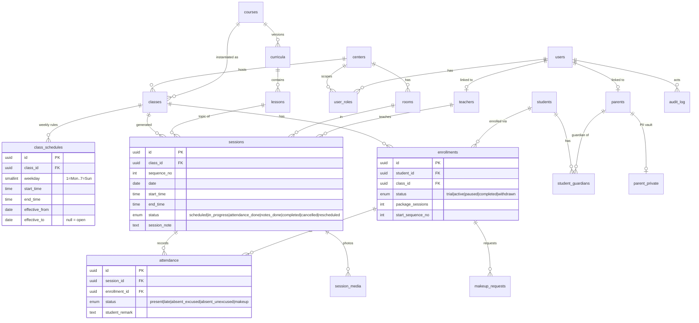

# ERD — Giai đoạn 1 (Academics + Identity)

Ràng buộc ngoài Drizzle (xem `packages/db/sql/0001_constraints.sql`): EXCLUDE trùng phòng/GV theo `tsrange`, CHECK giờ, trigger audit append-only, view `v_overdue_sessions`.
