# Kiến trúc menu khu quản trị

> Rà soát và tối ưu menu quản trị theo yêu cầu của chủ dự án (*"học bạ có 3 menu — cái nào sẽ dùng, cái nào nên lược bỏ…"*).
> Nguồn duy nhất của cây menu: `packages/core/src/nav/menu.ts` (kiểm thử `menu.test.ts`).
> Sidebar: `apps/web/src/components/admin-shell.tsx` · lọc quyền: `apps/web/src/app/(admin)/layout.tsx` ·
> chuyển hướng: `apps/web/next.config.ts` (dựng từ `LEGACY_REDIRECTS`) · kiểm thử trên máy thật: `scripts/kiem-thu/kiem-tra-menu.ps1`.

## 1. Kết quả tóm tắt

| | Trước | Sau |
|---|---:|---:|
| Mục trong sidebar (quản trị tối cao thấy hết) | **120** | **59** |
| Nhóm | 13 | 12 (11 nghiệp vụ + *Công cụ kỹ thuật*) |
| Nhóm lớn nhất | 15 mục (*Hệ thống & Cấu hình*) | 6 mục |
| Trang tới được từ menu (mục + chip) | 120 | 121 (thêm chỉ mục *Báo cáo*, chip *Ngày nghỉ*; bỏ 2 trang học bạ trùng, *Bảo mật tài khoản* sang menu tài khoản) |
| Mục học bạ | 3 (`/hoc-ba`, `/report-cards`, `/ho-so-hoc-tap`) | **1** — *Học bạ & hồ sơ học tập* |
| Mục báo cáo | 10 | **1** — *Báo cáo* (trang chỉ mục) |
| Mục chấm công | 7 | 2 (*Chấm công* + *Ca & công của tôi*) |
| Đường cũ phải chuyển hướng | — | 2 (`/hoc-ba`, `/report-cards`, 308, giữ truy vấn) |

Không nghiệp vụ nào bị xoá: mọi đường dẫn của menu cũ vẫn tới được — là mục, là **chip** của một trang trung tâm, được chuyển hướng,
hoặc nằm ở menu tài khoản (kiểm thử `không mất chức năng` trong `menu.test.ts` đối chiếu đủ 120 đường cũ).

## 2. Nguyên tắc áp dụng

1. **Menu theo nhiệm vụ**, không theo bảng dữ liệu. Tên nhóm là việc người dùng làm: *Tuyển sinh*, *Học viên*, *Lớp & lịch học*, *Chăm sóc & phụ huynh*…
2. **Mỗi nhóm ≤ 7 ± 2 mục, sâu tối đa 2 cấp** (nhóm → mục). Cấp thứ hai là **chip** trên đầu trang, không phải menu con lồng nhau.
3. **Một khái niệm — một nơi.** Nhiều trang cùng thực thể / nhiệm vụ → một mục *trang trung tâm* (hub) có dải chip.
   Chip dùng đường dẫn sẵn có của trang con nên **bookmark, liên kết trong thông báo / email cũ vẫn chạy mà không cần chuyển hướng**.
   Chỉ trang **bị thay thế thật sự** (nội dung dời sang trang khác) mới chuyển hướng 308.
4. **Chức năng phụ của một thực thể → chip / trang chi tiết của thực thể đó** (vd *Lịch sử thay đổi pool* là chip của *Chia & bàn giao lead*,
   *Tiêu chí học bạ* là nút trong chip *Học bạ mốc*).
5. **Công cụ kỹ thuật / dùng một lần** (nhập dữ liệu hệ cũ, go-live, chạy lại webhook, nhật ký email / OTP, 2 báo cáo tạm của đợt chuyển hệ)
   → nhóm **Công cụ kỹ thuật**, chữ nhóm màu nhạt, thu gọn với mọi vai trò trừ quản trị tối cao.
6. **Menu theo vai trò** — mỗi nhóm khai `roles` (vai trò mà nhóm *mở sẵn*). Đây là lọc hiển thị; hàng rào thật là quyền `perm`
   của mục / chip (lọc ở layout bằng `hasPermission`) và service vẫn `authorize()` chặt.
7. **Không chia hai nơi cho hai vai trò khác nhau thì không gộp**: *Tài liệu lớp tôi* (giáo viên) ≠ *Kho tài liệu* (đào tạo);
   *Thông báo của tôi* (hộp thư cá nhân) ≠ *Gửi thông báo phụ huynh* (CSKH) — chỉ đổi tên cho phân biệt.

## 3. Học bạ — quyết định

Đã đọc cả ba trang (và `docs/HO-SO-HOC-TAP.md`):

| Trang cũ | Thực chất | Còn giá trị? |
|---|---|---|
| `/hoc-ba` "Học bạ" | Chọn học viên → danh sách học bạ mốc (mọi trạng thái) kèm thanh điểm từng tiêu chí + nhận xét, chứng nhận; đã có nút "Mở hồ sơ học tập đầy đủ" | **Một phần.** Thanh điểm + nhận xét đã có (đầy đủ hơn, có biểu đồ tiến bộ, in PDF) trong hồ sơ học tập `/ho-so-hoc-tap/<HV>`. Nhưng hồ sơ chỉ hiện học bạ **đã gửi PH** — danh sách học bạ ở mọi trạng thái (nháp, chờ duyệt, trả lại) + lối vào viết / in vẫn cần. |
| `/report-cards` "Học bạ năng lực" | Chọn lớp → lưới học bạ mốc B5 / B12… theo học viên, lớp có học bạ chưa viết, **hàng đợi duyệt** (chờ duyệt → đã duyệt, chờ gửi PH) | **Có** — đây là luồng viết / duyệt học bạ mốc hằng ngày. |
| `/ho-so-hoc-tap` "Quản lý hồ sơ học tập" | Bảng chuẩn hồ sơ: tỷ lệ phiếu đúng hạn / đủ chuẩn, học bạ mốc quá hạn, theo GV / lớp, nhắc GV | **Có** — màn quản lý. |

**Quyết định:** một mục menu duy nhất **"Học bạ & hồ sơ học tập"** ở `/ho-so-hoc-tap` (nhóm *Học viên*), ba chip chế độ xem:

| Chip | Đường dẫn | Nội dung | Thay cho |
|---|---|---|---|
| Tổng quan chuẩn hồ sơ | `/ho-so-hoc-tap` | Màn quản lý hiện có (không đổi) | — |
| Học bạ mốc cần viết / duyệt | `/ho-so-hoc-tap?xem=hoc-ba-moc[&class=<lớp>]` | Lưới theo lớp + hàng đợi duyệt (giữ nguyên luồng duyệt); tên học viên mở hồ sơ học tập của khoá | `/report-cards` → **308** |
| Tra cứu học viên | `/ho-so-hoc-tap?xem=tra-cuu[&student=<HV>]` | Chọn học viên → nút lớn **Mở hồ sơ học tập**, chứng nhận, bảng học bạ mọi trạng thái (viết / duyệt / In). **Bỏ** thanh điểm + nhận xét từng học bạ (đã có trong hồ sơ). | `/hoc-ba` → **308** |

Trang chi tiết giữ nguyên đường dẫn và được tô sáng dưới mục này (`match`): viết / duyệt học bạ `/report-cards/<ghi danh>/<buổi>`,
tiêu chí `/report-cards/criteria`, in học bạ mốc `/hoc-ba-moc/<id>`, phiếu buổi `/phieu-buoi/<id>`, hồ sơ `/ho-so-hoc-tap/<HV>`.
Liên kết nội bộ đã đổi sang đường mới: nút quay lại của trang viết học bạ và trang tiêu chí, hàng *Học bạ* ở **Việc hôm nay**
(`packages/api/src/services/inbox.ts`) và hàng đợi *Học bạ kỳ chưa viết* ở **Dashboard** (`dashboard.ts`). Procedure tRPC không đổi tên
(`learning.studentReportBook`, `learning.classReportCards`, `learning.reviewQueue`… vẫn dùng).

## 4. Các cụm trùng khác — đã đọc từng trang

| Cụm | Kết luận sau khi đọc trang | Cách xử lý |
|---|---|---|
| Ảnh: `/media` · `/duyet-media` | Cùng thực thể ảnh lớp: kho (tải, gắn thẻ, gửi duyệt) và bước duyệt | Gộp: mục **Ảnh lớp học**, chip *Kho ảnh* · *Duyệt ảnh* (chip duyệt chỉ hiện với `media:update`) |
| Khảo sát: `/evaluations` · `/khao-sat` · `/parent-feedback` | Cùng họ "ý kiến phụ huynh": phiếu v2 + đợt; NPS bản cũ (đang thay dần); đánh giá buổi học 1–5 sao | Gộp: mục **Đánh giá & khảo sát**, 3 chip (NPS ghi rõ "bản cũ") |
| Thông báo: `/notifications` · `/thong-bao` | **Khác nhiệm vụ & vai trò**: gửi thông báo cho PH (CSKH, `care:read`) vs hộp thông báo cá nhân (mọi nhân sự) | **Không gộp.** Đổi tên *Gửi thông báo phụ huynh* (Chăm sóc) và *Thông báo của tôi* (Tổng quan) |
| Tin nhắn: `/tin-nhan` · `/hoi-thoai` · `/crm/messenger` | Cùng hộp thư: hộp thư chung; góc nhìn gắn lead của hội thoại mạng xã hội (tự có nút "Mở hộp thư"); giám sát SLA (tự có nút "Hộp thư →") | Gộp: mục **Tin nhắn**, 3 chip; *Giám sát* chỉ hiện với `message:audit`, *Messenger CRM* cần cả `message:read` + `lead:read` |
| Nhập dữ liệu: `/nhap-khach-hang` · `/leads/import` · `/leads/import/registered` | Ba cách đưa khách vào CRM | Gộp: mục **Nhập khách hàng**, chip *Nhập tay* · *Từ file* · *Khách đã đăng ký* |
| CRM: `/crm` · `/leads` (+ `/lead-nguoi`, `/leads/bao-cao-chuyen`) | `/crm` là dashboard phễu của chính dữ liệu lead (có nút "Xem Kanban" → `/leads?view=kanban`) | Gộp: mục **Lead**, 4 chip |
| Nhân sự: `/teachers` · `/nhan-su` (+ `/nhan-su/vi-tri`) | Giáo viên là một loại nhân sự; khác quyền (`teacher:read` vs `staff:read`) | Gộp: mục **Nhân sự & giáo viên**; người chỉ có `teacher:read` (Đào tạo) bấm mục là vào thẳng chip *Giáo viên* |
| Tài liệu: `/documents` · `/teaching-materials` | Kho quản trị theo khoá / bài vs "tài liệu lớp tôi" của giáo viên | **Không gộp** (khác vai trò). `/scorm` là một loại tài liệu → chip của **Kho tài liệu** |
| Khoá: `/course-prerequisites` · `/lo-trinh` | Tiên quyết = điều kiện chặn ghi danh; lộ trình = chuỗi khoá + giấy chứng nhận lộ trình | **Không gộp.** Tiên quyết → chip của **Khoá học** (cùng *Gói khoá học*); **Lộ trình & chứng nhận** giữ mục riêng |
| Cấu hình: `/settings` · `/cau-hinh-van-hanh` (+ `/email-templates`) | Cùng nhiệm vụ cấu hình; *Cấu hình vận hành* đã có tab "Công ty" trỏ về `/settings` | Gộp: mục **Cấu hình**, chip *Cấu hình vận hành* · *Cài đặt chung* · *Mẫu email* |
| Phương thức TT: `/payment-methods` · tab `phuong-thuc-tt` của Cấu hình vận hành | Trùng nội dung, nhưng kế toán không có `automation:read` nên không vào được Cấu hình vận hành | Giữ trang, thành chip của **Thu tiền** |
| Nhật ký kỹ thuật: `/email-logs`, `/otp-logs`, `/crm/webhook-replay`, `/chuyen-doi`, `/nhap-giao-dich-cu`, `/go-live`, `/bao-cao/sau-go-live`, `/bao-cao/chat-pilot` | Công cụ quản trị / dùng một lần khi chuyển hệ | Nhóm **Công cụ kỹ thuật** (4 mục). Hai báo cáo tạm thời giờ cần thêm `cutover:read` để hiện trong menu (trang vẫn kiểm `report:read` như cũ) |
| Báo cáo: 10 trang `/bao-cao/*` | Cùng nhiệm vụ "xem báo cáo" | 1 mục **Báo cáo** (nhóm Tổng quan) → trang chỉ mục `/bao-cao` (thẻ: tên, mô tả một dòng, *nên xem*); chip trên đầu mỗi báo cáo để chuyển nhanh |
| Chấm công: 7 mục | 6 màn quản lý + 1 màn cá nhân | Mục **Chấm công** (6 chip) trong *Nhân sự*; *Ca & công của tôi* lên *Tổng quan* vì mọi nhân viên đều dùng |

## 5. Bảng chuyển hướng

| Đường cũ | Đường mới | Mã | Truy vấn |
|---|---|---|---|
| `/hoc-ba` | `/ho-so-hoc-tap?xem=tra-cuu` | 308 | `?student=<id>` giữ nguyên → mở sẵn học viên |
| `/report-cards` | `/ho-so-hoc-tap?xem=hoc-ba-moc` | 308 | `?class=<id>` giữ nguyên → mở sẵn lớp |

Chỉ khớp **đúng** đường gốc: `/report-cards/<ghi danh>/<buổi>` và `/report-cards/criteria` không bị ảnh hưởng.
Chuyển hướng chạy ở `next.config.ts` (trước proxy đăng nhập). Mọi đường khác của menu cũ **không đổi** — chúng là chip nên không cần chuyển hướng.
Mục cũ rời sidebar nhưng trang vẫn giữ: `/bao-mat` (Bảo mật tài khoản) → menu tài khoản góc phải + Ctrl+K.

## 6. Cây menu mới

`(kỹ thuật)` = nhóm Công cụ kỹ thuật. Dòng nhỏ dưới tên mục = các chip của trang trung tâm.

```mermaid
flowchart LR
  ROOT(["Menu quản trị"])
  ROOT --> G0["Tổng quan"]
  G0 --> G0_0["Việc hôm nay"]
  G0 --> G0_1["Dashboard"]
  G0 --> G0_2["Báo cáo<br/><small>Tất cả báo cáo · Báo cáo Lead · Báo cáo trải nghiệm · Báo cáo đào tạo · Hiệu suất giáo viên · Cohort tiến độ · Churn / rời bỏ · Báo cáo trung tâm · Doanh thu vs mục tiêu</small>"]
  G0 --> G0_3["Thông báo của tôi"]
  G0 --> G0_4["Ca & công của tôi"]
  G0 --> G0_5["Hướng dẫn & đào tạo"]
  ROOT --> G1["Tuyển sinh (CRM)"]
  G1 --> G1_0["Lead<br/><small>Danh sách lead · Tổng quan CRM · Lâu ngày chưa chăm · Chuyển liên cơ sở</small>"]
  G1 --> G1_1["Nhập khách hàng<br/><small>Nhập tay · Từ file · Khách đã đăng ký</small>"]
  G1 --> G1_2["Chốt hàng loạt"]
  G1 --> G1_3["Chia & bàn giao lead<br/><small>Chia lead · Lịch sử thay đổi pool · Bàn giao lead</small>"]
  G1 --> G1_4["Học thử<br/><small>Lớp trải nghiệm · Học thử buổi lẻ</small>"]
  G1 --> G1_5["Nguồn giới thiệu"]
  ROOT --> G2["Học viên"]
  G2 --> G2_0["Học viên<br/><small>Danh sách · Sắp hết khoá · Tài khoản phụ huynh · Thẻ học viên (QR)</small>"]
  G2 --> G2_1["Đăng ký học<br/><small>Đăng ký học · Chuyển lớp / cơ sở</small>"]
  G2 --> G2_2["Học bạ & hồ sơ học tập<br/><small>Tổng quan chuẩn hồ sơ · Học bạ mốc cần viết / duyệt · Tra cứu học viên</small>"]
  G2 --> G2_3["Hoàn thành khoá & chứng nhận"]
  G2 --> G2_4["SataCoin"]
  ROOT --> G3["Lớp & lịch học"]
  G3 --> G3_0["Lớp học<br/><small>Lớp học · Nhóm lớp · Kiểm tra lịch buổi</small>"]
  G3 --> G3_1["Lịch & buổi học<br/><small>Lịch tổng · Buổi học</small>"]
  G3 --> G3_2["Điểm danh"]
  G3 --> G3_3["Học bù"]
  G3 --> G3_4["Ảnh lớp học<br/><small>Kho ảnh · Duyệt ảnh</small>"]
  G3 --> G3_5["Cơ sở & phòng học<br/><small>Cơ sở · Phòng học · Ngày nghỉ</small>"]
  ROOT --> G4["Chương trình & học liệu"]
  G4 --> G4_0["Chương trình học<br/><small>Chương trình học · Đề xuất sửa giáo án</small>"]
  G4 --> G4_1["Khoá học<br/><small>Khoá học · Gói khoá học · Khoá tiên quyết</small>"]
  G4 --> G4_2["Lộ trình & chứng nhận"]
  G4 --> G4_3["Kho tài liệu<br/><small>Tài liệu giảng dạy · SCORM / bài giảng tương tác</small>"]
  G4 --> G4_4["Tài liệu lớp tôi"]
  G4 --> G4_5["Bài tập về nhà"]
  ROOT --> G5["Chăm sóc & phụ huynh"]
  G5 --> G5_0["Tin nhắn<br/><small>Hộp thư · Messenger CRM · Giám sát hội thoại</small>"]
  G5 --> G5_1["Yêu cầu phụ huynh"]
  G5 --> G5_2["Chăm sóc học viên<br/><small>Việc chăm sóc · Cảnh báo rủi ro · Sinh nhật</small>"]
  G5 --> G5_3["Đánh giá & khảo sát<br/><small>Phiếu & đợt khảo sát · Khảo sát NPS (bản cũ) · Đánh giá buổi học từ PH</small>"]
  G5 --> G5_4["Gửi thông báo phụ huynh"]
  ROOT --> G6["Nhân sự"]
  G6 --> G6_0["Nhân sự & giáo viên<br/><small>Hồ sơ nhân sự · Giáo viên · Vị trí công việc</small>"]
  G6 --> G6_1["Chấm công<br/><small>Bảng công · Lưới phân ca · Kỳ công & chốt · Mã ca · Điểm chấm công · Màn hình QR</small>"]
  G6 --> G6_2["Duyệt đơn từ"]
  G6 --> G6_3["Tuyển dụng"]
  ROOT --> G7["Tài chính"]
  G7 --> G7_0["Đơn hàng"]
  G7 --> G7_1["Thu tiền<br/><small>Phiếu thu · Biến động số dư · Phương thức thanh toán</small>"]
  G7 --> G7_2["Công nợ<br/><small>Công nợ · Thiếu học phí</small>"]
  G7 --> G7_3["Hoàn tiền"]
  G7 --> G7_4["Hoá đơn điện tử"]
  G7 --> G7_5["Hoa hồng"]
  ROOT --> G8["Kho & sản phẩm"]
  G8 --> G8_0["Học cụ (Kits)"]
  G8 --> G8_1["Sản phẩm bán / thuê"]
  G8 --> G8_2["Tồn kho<br/><small>Tồn kho · Kiểm kê kho</small>"]
  ROOT --> G9["Website & marketing"]
  G9 --> G9_0["Website<br/><small>Tin tức · Nội dung trang</small>"]
  G9 --> G9_1["Marketing<br/><small>Tracking · Funnel</small>"]
  ROOT --> G10["Hệ thống"]
  G10 --> G10_0["Tài khoản & phân quyền<br/><small>Tài khoản · Nhóm người dùng · Vai trò & quyền</small>"]
  G10 --> G10_1["Tổ chức & nhượng quyền<br/><small>Cây tổ chức · Nhượng quyền</small>"]
  G10 --> G10_2["Bảo mật & tuân thủ<br/><small>Bảo mật hệ thống · Nhật ký thao tác · Tuân thủ dữ liệu</small>"]
  G10 --> G10_3["Cấu hình<br/><small>Cấu hình vận hành · Cài đặt chung · Mẫu email</small>"]
  G10 --> G10_4["Tích hợp"]
  G10 --> G10_5["Vận hành & sao lưu"]
  ROOT --> G11["Công cụ kỹ thuật (kỹ thuật)"]
  G11 --> G11_0["Nhật ký gửi<br/><small>Email · OTP</small>"]
  G11 --> G11_1["Chạy lại webhook"]
  G11 --> G11_2["Nhập dữ liệu hệ cũ<br/><small>Chuyển đổi dữ liệu · Nhập giao dịch cũ</small>"]
  G11 --> G11_3["Go-live<br/><small>Go-live cơ sở · Sau go-live · Đo pilot chat</small>"]
```



### Nhóm mở sẵn theo vai trò (`roles` của nhóm)

| Nhóm | Mở sẵn cho |
|---|---|
| Tổng quan | mọi vai trò |
| Tuyển sinh (CRM) | Tư vấn Hội sở, Marketing Hội sở, Tư vấn / CSKH cơ sở, Quản lý cơ sở |
| Học viên | Giáo vụ, Tư vấn / CSKH, Đào tạo, Quản lý cơ sở |
| Lớp & lịch học | Giáo vụ, Giáo viên, Trợ giảng, Đào tạo, Quản lý cơ sở |
| Chương trình & học liệu | Đào tạo, Giáo viên, Trợ giảng, Giáo vụ |
| Chăm sóc & phụ huynh | Tư vấn / CSKH, Giáo vụ, Quản lý cơ sở |
| Nhân sự | Nhân sự Hội sở, Nhân sự cơ sở |
| Tài chính | Kế toán Hội sở, Kế toán cơ sở, Quản lý cơ sở |
| Kho & sản phẩm | Kế toán Hội sở, Kế toán cơ sở |
| Website & marketing | Marketing Hội sở |
| Hệ thống | Quản trị tối cao, Kiểm soát |
| Công cụ kỹ thuật | Quản trị tối cao |

## 7. Số mục theo vai trò — trước / sau

Tính bằng chính `hasPermission` của policy engine cho một tài khoản chỉ mang vai trò đó (cột "trước" = menu cũ lọc quyền như layout cũ).
*Mục trong nhóm mở sẵn* = số dòng người dùng thấy ngay khi mở trang lần đầu, trước khi tự mở nhóm khác.

| Vai trò | Trước: mục menu | Trước: nhóm | Sau: mục menu | Sau: nhóm | Sau: mục trong nhóm mở sẵn | Sau: trang tới được (mục + chip) |
|---|---:|---:|---:|---:|---:|---:|
| Quản trị tối cao (`SUPER_ADMIN`) | 120 | 13 | 59 | 12 | 16 | 121 |
| Kế toán Hội sở (`HO_ACCOUNTANT`) | 55 | 10 | 29 | 9 | 15 | 53 |
| Nhân sự Hội sở (`HO_HR`) | 27 | 4 | 10 | 2 | 10 | 25 |
| Marketing Hội sở (`HO_MARKETING`) | 33 | 6 | 14 | 4 | 13 | 31 |
| Tư vấn Hội sở (`HO_SALE`) | 18 | 4 | 9 | 2 | 9 | 17 |
| Đào tạo (`TRAINING`) | 37 | 8 | 18 | 6 | 16 | 36 |
| Kiểm soát (`AUDITOR`) | 109 | 13 | 57 | 12 | 12 | 110 |
| Quản lý cơ sở (`CENTER_MANAGER`) | 103 | 12 | 52 | 12 | 34 | 104 |
| Giáo vụ cơ sở (`CENTER_CLASS_MANAGER`) | 45 | 8 | 28 | 8 | 23 | 44 |
| Tư vấn / CSKH cơ sở (`CENTER_SALES_CSM`) | 65 | 10 | 38 | 9 | 20 | 64 |
| Kế toán cơ sở (`CENTER_ACCOUNTANT`) | 56 | 10 | 29 | 9 | 15 | 54 |
| Nhân sự cơ sở (`CENTER_HR`) | 18 | 4 | 10 | 3 | 9 | 17 |
| Giáo viên (`TEACHER`) | 31 | 7 | 19 | 6 | 14 | 29 |
| Trợ giảng (`ASSISTANT_TEACHER`) | 24 | 6 | 15 | 4 | 14 | 23 |

## 8. Sidebar mới

- **Ô tìm trong menu** ở đầu sidebar: lọc theo chữ gõ, **không dấu cũng khớp** (`hoc ba` → *Học bạ & hồ sơ học tập*), tìm cả tên chip
  (`duyet anh` → *Ảnh lớp học › Duyệt ảnh*), mô tả và từ khoá. Enter mở kết quả đầu, Esc xoá.
- **Nhóm mở sẵn theo vai trò**; nhóm khác thu gọn (tiêu đề hiện số mục). Người dùng tự mở / đóng thì nhớ lại
  (`localStorage` khoá `admin-nav-open-v2`, bọc try/catch). Nhóm chứa trang đang mở luôn mở.
- **Ghim** tối đa **8** mục (hoặc chip) lên khối *Đã ghim* ở đầu menu: rê chuột vào dòng → biểu tượng ghim.
  Lưu ở `localStorage` khoá `admin-nav-pins`; mục không còn quyền tự ẩn khỏi khối ghim.
- **Dải chip** của trang trung tâm do `AdminShell` dựng từ cây menu (đã lọc quyền), hiện trên đầu mọi trang là một chip;
  trang chi tiết (`/leads/<id>`…) không hiện dải chip nhưng vẫn tô sáng mục cha.
- **Tô sáng** theo tiền tố dài nhất (`activeNavItem`): `/leads/import` thuộc *Nhập khách hàng*, không thuộc *Lead*.
- **Bảng lệnh Ctrl+K** tìm cả chip ("Học bạ & hồ sơ học tập › Tra cứu học viên"), từ khoá của mục; thêm hành động nhanh
  *Học bạ cần viết / duyệt*, *Tra cứu hồ sơ học tập*, *Xem báo cáo*, *Bảo mật tài khoản*.
- HTML sidebar giữ cả nhóm thu gọn (thẻ `ul hidden`) và gắn `data-nav-href` / `data-nav-tab` để bộ kiểm thử đọc được đúng những gì người dùng được thấy.

## 9. Thêm / sửa mục menu

1. Sửa `packages/core/src/nav/menu.ts` (mục thường: `perm`; trang trung tâm: `tabs`, chip đầu = `href` của mục).
   Icon phải có trong bảng `NAV_ICON` của `admin-shell.tsx`.
2. Trang bị thay thế → thêm dòng `LEGACY_REDIRECTS` (next.config tự dựng 308) và xoá `page.tsx` cũ.
3. Chạy test core, cập nhật bản kê cho bộ kiểm thử PowerShell:
   ```bash
   CAP_NHAT_MENU=1 node --experimental-transform-types --import /tmp/reg.mjs --test packages/core/src/nav/menu.test.ts
   node --experimental-transform-types --import /tmp/reg.mjs --test "packages/core/src/**/*.test.ts"
   ```
   (Windows: `$env:CAP_NHAT_MENU=1; pnpm --filter @satarobo/core test`.) `apps/web` đọc `@satarobo/core` từ `dist/` —
   sau khi sửa menu chạy `pnpm --filter @satarobo/core build` trước khi `pnpm dev`.

Các ràng buộc `menu.test.ts` giữ: href duy nhất; mỗi nhóm ≤ 9 mục; trang trung tâm ≥ 2 chip và `href` = chip đầu; tiền tố đường dẫn không thuộc
hai mục; mọi đường cũ trong bảng chuyển hướng trỏ tới href tồn tại (và nguồn không còn `page.tsx`); đủ 120 đường của menu cũ còn chỗ đi;
mọi href có `page.tsx` thật trong `apps/web`; `menu-manifest.json` khớp cây.

## 10. Kiểm thử trên máy thật

`scripts/kiem-thu/kiem-tra-menu.ps1` — xem `docs/KIEM-THU-TOAN-DIEN.md` mục *Kiểm tra menu*. Với 7 tài khoản mẫu: mở mọi mục + chip người đó thấy
(200, không có dấu hiệu lỗi), mọi mục bị ẩn theo quyền (phải là trang "không có quyền" / 403 / chuyển đăng nhập, không lộ dữ liệu)
và mọi đường cũ (308 đúng đích, giữ truy vấn).

## 11. Rủi ro / cần kiểm lại trên máy thật

- `next.config.ts` và `apps/web` dùng `@satarobo/core` bản **build** (`dist/`): phải build lại core, nếu không `nextRedirects` / `filterMenu` chưa có → lỗi khởi động.
- Chuyển hướng giữ truy vấn dựa vào hành vi của Next.js (truy vấn yêu cầu được nối vào đích có sẵn `?xem=`) — bộ kiểm thử PowerShell kiểm đúng điều này.
- Trang không tự kiểm quyền ở đầu trang (dựa vào service ném FORBIDDEN) sẽ hiện trang lỗi "Không có quyền truy cập" của `error.tsx` —
  bộ kiểm thử chấp nhận dạng này; nếu thấy trang hiện dữ liệu cho người không có quyền thì đó là lỗi phân quyền cần sửa ở service.
- Người đã quen menu cũ: nút ghim + ô tìm menu + Ctrl+K bù lại; nên thông báo đổi menu trong *Hướng dẫn & đào tạo*.
- Trạng thái nhóm lưu theo khoá mới (`admin-nav-open-v2`) — lần đầu sau cập nhật, nhóm mở theo vai trò thay vì theo lựa chọn cũ.
- Hai báo cáo tạm (*Sau go-live*, *Đo pilot chat*) giờ chỉ hiện trong menu với người có cả `report:read` + `cutover:read` (Quản trị, Kiểm soát, Quản lý cơ sở); kế toán / nhân sự Hội sở vẫn mở được bằng đường dẫn.

## 12. Bảng kiểm kê đầy đủ menu cũ (120 mục)

Viết tắt vai trò: QT Quản trị tối cao · KT-HS Kế toán Hội sở · NS-HS Nhân sự Hội sở · MKT Marketing Hội sở · TV-HS Tư vấn Hội sở · ĐT Đào tạo ·
KS Kiểm soát · QLCS Quản lý cơ sở · GVụ Giáo vụ · TV/CSKH Tư vấn / CSKH cơ sở · KT Kế toán cơ sở · NS Nhân sự cơ sở · GV Giáo viên · TG Trợ giảng.
*Ẩn theo vai trò* áp cho mọi mục: nhóm không thuộc vai trò hiện tại thu gọn (mục 6).

| # | Nhóm cũ | Mục cũ | Đường dẫn | Quyết định | Vị trí mới | Lý do | Ai dùng (vai trò có quyền) |
|---:|---|---|---|---|---|---|---|
| 1 | Tổng quan | Việc hôm nay | `/viec-hom-nay` | Giữ | Tổng quan › Việc hôm nay | Màn khởi đầu của mọi vai trò | mọi vai trò |
| 2 | Tổng quan | Dashboard | `/dashboard` | Giữ | Tổng quan › Dashboard | Số liệu nhanh trong ngày | mọi vai trò |
| 3 | Tổng quan | Hướng dẫn & đào tạo | `/huong-dan` | Giữ | Tổng quan › Hướng dẫn & đào tạo | Đào tạo theo vai trò | mọi vai trò |
| 4 | Tổng quan | Bảo mật tài khoản | `/bao-mat` | Chuyển khỏi sidebar | Menu tài khoản + Ctrl+K | Cài đặt cá nhân, đã có ở menu tài khoản — không cần chiếm chỗ sidebar | mọi vai trò |
| 5 | Tổng quan | CRM | `/crm` | Gộp vào Lead | Tuyển sinh (CRM) › Lead › chip “Tổng quan CRM” | Cùng thực thể lead; là một chế độ xem (phễu) của danh sách lead | QT, MKT, TV-HS, KS, QLCS, TV/CSKH |
| 6 | CRM & Tuyển sinh | Leads | `/leads` | Giữ — thành trang trung tâm | Tuyển sinh (CRM) › Lead › chip “Danh sách lead” | Trang trung tâm của lead | QT, MKT, TV-HS, KS, QLCS, TV/CSKH |
| 7 | CRM & Tuyển sinh | Nhập khách hàng | `/nhap-khach-hang` | Giữ — thành trang trung tâm | Tuyển sinh (CRM) › Nhập khách hàng › chip “Nhập tay” | Ba cách nhập khách là một nhiệm vụ: đưa khách vào CRM | QT, MKT, TV-HS, QLCS, TV/CSKH |
| 8 | CRM & Tuyển sinh | Nhập lead từ file | `/leads/import` | Gộp vào Nhập khách hàng | Tuyển sinh (CRM) › Nhập khách hàng › chip “Từ file” | Cùng nhiệm vụ nhập khách | QT, MKT, TV-HS, QLCS, TV/CSKH |
| 9 | CRM & Tuyển sinh | Nhập khách đã đăng ký | `/leads/import/registered` | Gộp vào Nhập khách hàng | Tuyển sinh (CRM) › Nhập khách hàng › chip “Khách đã đăng ký” | Cùng nhiệm vụ nhập khách | QT, MKT, TV-HS, QLCS, TV/CSKH |
| 10 | CRM & Tuyển sinh | Chốt hàng loạt | `/leads/bulk-convert` | Giữ | Tuyển sinh (CRM) › Chốt hàng loạt | Nhiệm vụ riêng (chốt nhiều lead thành ghi danh), quyền riêng | QT, QLCS, TV/CSKH |
| 11 | CRM & Tuyển sinh | Quản lý chia lead | `/quan-ly-chia-lead` | Giữ — thành trang trung tâm | Tuyển sinh (CRM) › Chia & bàn giao lead › chip “Chia lead” | Trang trung tâm việc phân lead | QT, TV-HS, QLCS, TV/CSKH |
| 12 | CRM & Tuyển sinh | Lịch sử thay đổi pool | `/quan-ly-chia-lead/lich-su` | Gộp vào Chia & bàn giao lead | Tuyển sinh (CRM) › Chia & bàn giao lead › chip “Lịch sử thay đổi pool” | Chức năng phụ của pool chia lead | QT, MKT, TV-HS, KS, QLCS, TV/CSKH |
| 13 | CRM & Tuyển sinh | Bàn giao lead | `/ban-giao-lead` | Gộp vào Chia & bàn giao lead | Tuyển sinh (CRM) › Chia & bàn giao lead › chip “Bàn giao lead” | Cùng nhiệm vụ phân lead cho sale | QT, TV-HS, QLCS, TV/CSKH |
| 14 | CRM & Tuyển sinh | Lead lâu ngày chưa chăm | `/lead-nguoi` | Gộp vào Lead | Tuyển sinh (CRM) › Lead › chip “Lâu ngày chưa chăm” | Một bộ lọc của danh sách lead | QT, MKT, TV-HS, KS, QLCS, TV/CSKH |
| 15 | CRM & Tuyển sinh | Chuyển lead liên CS | `/leads/bao-cao-chuyen` | Gộp vào Lead | Tuyển sinh (CRM) › Lead › chip “Chuyển liên cơ sở” | Một chế độ xem của lead | QT, MKT, TV-HS, KS, QLCS, TV/CSKH |
| 16 | CRM & Tuyển sinh | Nguồn giới thiệu | `/affiliates` | Giữ | Tuyển sinh (CRM) › Nguồn giới thiệu | Thực thể riêng (người giới thiệu) | QT, KT-HS, MKT, KS, QLCS, TV/CSKH, KT |
| 17 | CRM & Tuyển sinh | Messenger CRM | `/crm/messenger` | Gộp vào Tin nhắn | Chăm sóc & phụ huynh › Tin nhắn › chip “Messenger CRM” | Cùng hộp thư mạng xã hội — một nơi cho tin nhắn | QT, MKT, KS, QLCS, GVụ, TV/CSKH, GV |
| 18 | CRM & Tuyển sinh | Lớp Trial | `/lop-trial` | Giữ — thành trang trung tâm | Tuyển sinh (CRM) › Học thử › chip “Lớp trải nghiệm” | Trang trung tâm học thử | QT, MKT, TV-HS, ĐT, KS, QLCS, GVụ, TV/CSKH, GV |
| 19 | CRM & Tuyển sinh | Học thử buổi lẻ | `/lop-trial/buoi-le` | Gộp vào Học thử | Tuyển sinh (CRM) › Học thử › chip “Học thử buổi lẻ” | Cùng nhiệm vụ học thử | QT, MKT, TV-HS, KS, QLCS, TV/CSKH |
| 20 | Học viên & Đăng ký học | Học viên | `/students` | Giữ — thành trang trung tâm | Học viên › Học viên › chip “Danh sách” | Trang trung tâm học viên | QT, KT-HS, KS, QLCS, GVụ, TV/CSKH, KT, GV, TG |
| 21 | Học viên & Đăng ký học | Tài khoản phụ huynh | `/students/tai-khoan` | Gộp vào Học viên | Học viên › Học viên › chip “Tài khoản phụ huynh” | Thuộc học viên (tài khoản PH của bé) | QT, KS, QLCS, TV/CSKH |
| 22 | Học viên & Đăng ký học | Thẻ học viên (QR) | `/the-hoc-vien` | Gộp vào Học viên | Học viên › Học viên › chip “Thẻ học viên (QR)” | Thao tác trên học viên (in thẻ) | QT, KT-HS, KS, QLCS, GVụ, TV/CSKH, KT, GV, TG |
| 23 | Học viên & Đăng ký học | Đăng ký học | `/enrollments` | Giữ — thành trang trung tâm | Học viên › Đăng ký học › chip “Đăng ký học” | Trang trung tâm ghi danh | QT, KT-HS, KS, QLCS, GVụ, TV/CSKH, KT |
| 24 | Học viên & Đăng ký học | Chuyển lớp / cơ sở | `/chuyen-lop` | Gộp vào Đăng ký học | Học viên › Đăng ký học › chip “Chuyển lớp / cơ sở” | Thao tác trên ghi danh | QT, QLCS, GVụ, TV/CSKH |
| 25 | Học viên & Đăng ký học | Sắp hết khoá | `/students/sap-het-khoa` | Gộp vào Học viên | Học viên › Học viên › chip “Sắp hết khoá” | Một bộ lọc của học viên | QT, KT-HS, KS, QLCS, GVụ, TV/CSKH, KT |
| 26 | Học viên & Đăng ký học | Hoàn thành khoá & chứng nhận | `/hoan-thanh-khoa` | Giữ | Học viên › Hoàn thành khoá & chứng nhận | Nhiệm vụ riêng (duyệt hoàn thành, cấp chứng nhận) | QT, KT-HS, KS, QLCS, GVụ, TV/CSKH, KT |
| 27 | Học viên & Đăng ký học | Học bạ | `/hoc-ba` | Gộp (chuyển hướng 308) | /ho-so-hoc-tap?xem=tra-cuu | Đã được hồ sơ học tập thay thế; phần còn giá trị (học bạ mọi trạng thái) thành chip Tra cứu | QT, ĐT, KS, QLCS, GVụ, GV |
| 28 | Học viên & Đăng ký học | Học bạ năng lực | `/report-cards` | Gộp (chuyển hướng 308) | /ho-so-hoc-tap?xem=hoc-ba-moc | Lưới học bạ mốc + hàng đợi duyệt thành chip Học bạ mốc | QT, ĐT, KS, QLCS, GVụ, GV |
| 29 | Học viên & Đăng ký học | Quản lý hồ sơ học tập | `/ho-so-hoc-tap` | Giữ — thành trang trung tâm | Học viên › Học bạ & hồ sơ học tập › chip “Tổng quan chuẩn hồ sơ” | Một nơi duy nhất cho học bạ & hồ sơ | QT, ĐT, KS, QLCS, GVụ, GV |
| 30 | Học viên & Đăng ký học | SataCoin | `/satacoin` | Giữ | Học viên › SataCoin | Thực thể riêng (sổ xu) | QT, KT-HS, KS, QLCS, GVụ, TV/CSKH, KT, GV |
| 31 | Lớp học & Lịch học | Lớp học | `/classes` | Giữ — thành trang trung tâm | Lớp & lịch học › Lớp học › chip “Lớp học” | Trang trung tâm lớp | QT, KT-HS, ĐT, KS, QLCS, GVụ, TV/CSKH, KT, GV, TG |
| 32 | Lớp học & Lịch học | Nhóm lớp | `/class-groups` | Gộp vào Lớp học | Lớp & lịch học › Lớp học › chip “Nhóm lớp” | Thuộc lớp (gom nhóm lớp) | QT, KT-HS, ĐT, KS, QLCS, GVụ, TV/CSKH, KT, GV, TG |
| 33 | Lớp học & Lịch học | Buổi học | `/sessions` | Gộp vào Lịch & buổi học | Lớp & lịch học › Lịch & buổi học › chip “Buổi học” | Cùng lịch: danh sách buổi là chế độ xem khác của lịch | QT, ĐT, KS, QLCS, GVụ, TV/CSKH, GV, TG |
| 34 | Lớp học & Lịch học | Kiểm tra lịch buổi | `/classes/kiem-tra-lich` | Gộp vào Lớp học | Lớp & lịch học › Lớp học › chip “Kiểm tra lịch buổi” | Công cụ phụ của lớp | QT, KT-HS, ĐT, KS, QLCS, GVụ, TV/CSKH, KT, GV, TG |
| 35 | Lớp học & Lịch học | Lịch tổng | `/lich` | Giữ — thành trang trung tâm | Lớp & lịch học › Lịch & buổi học › chip “Lịch tổng” | Trang trung tâm lịch | QT, ĐT, KS, QLCS, GVụ, TV/CSKH, GV, TG |
| 36 | Lớp học & Lịch học | Điểm danh | `/attendance` | Giữ | Lớp & lịch học › Điểm danh | Nhiệm vụ hằng ngày | QT, KS, QLCS, GVụ |
| 37 | Lớp học & Lịch học | Ảnh lớp học | `/media` | Giữ — thành trang trung tâm | Lớp & lịch học › Ảnh lớp học › chip “Kho ảnh” | Trang trung tâm ảnh lớp | QT, KS, QLCS, GVụ |
| 38 | Lớp học & Lịch học | Duyệt ảnh | `/duyet-media` | Gộp vào Ảnh lớp học | Lớp & lịch học › Ảnh lớp học › chip “Duyệt ảnh” | Bước duyệt của cùng thực thể ảnh | QT, QLCS, GVụ |
| 39 | Lớp học & Lịch học | Học bù | `/hoc-bu` | Giữ | Lớp & lịch học › Học bù | Nhiệm vụ hằng ngày | QT, KS, QLCS, GVụ, TV/CSKH |
| 40 | Lớp học & Lịch học | Cơ sở | `/centers` | Giữ — thành trang trung tâm | Lớp & lịch học › Cơ sở & phòng học › chip “Cơ sở” | Trang trung tâm cơ sở | QT, KS, QLCS, GVụ, TV/CSKH, KT, NS |
| 41 | Lớp học & Lịch học | Phòng học | `/rooms` | Gộp vào Cơ sở & phòng học | Lớp & lịch học › Cơ sở & phòng học › chip “Phòng học” | Thuộc cơ sở | QT, KT-HS, ĐT, KS, QLCS, GVụ, TV/CSKH, KT, GV, TG |
| 42 | LMS / Học liệu | Chương trình học | `/curriculums` | Giữ — thành trang trung tâm | Chương trình & học liệu › Chương trình học › chip “Chương trình học” | Trang trung tâm chương trình | QT, ĐT, KS, QLCS, GVụ, GV, TG |
| 43 | LMS / Học liệu | Đề xuất sửa giáo án | `/de-xuat-giao-an` | Gộp vào Chương trình học | Chương trình & học liệu › Chương trình học › chip “Đề xuất sửa giáo án” | Quy trình sửa của chương trình học | QT, ĐT, KS, QLCS, GVụ, GV, TG |
| 44 | LMS / Học liệu | Khoá học | `/courses` | Giữ — thành trang trung tâm | Chương trình & học liệu › Khoá học › chip “Khoá học” | Trang trung tâm khoá | QT, KT-HS, ĐT, KS, QLCS, GVụ, TV/CSKH, KT, GV, TG |
| 45 | LMS / Học liệu | Gói khoá học | `/course-packages` | Gộp vào Khoá học | Chương trình & học liệu › Khoá học › chip “Gói khoá học” | Thuộc khoá (gói bán) | QT, KT-HS, ĐT, KS, QLCS, GVụ, TV/CSKH, KT, GV, TG |
| 46 | LMS / Học liệu | Khoá tiên quyết | `/course-prerequisites` | Gộp vào Khoá học | Chương trình & học liệu › Khoá học › chip “Khoá tiên quyết” | Thuộc khoá (điều kiện ghi danh). KHÔNG gộp với Lộ trình: khác khái niệm (chặn ghi danh vs chuỗi khoá + chứng nhận) | QT, KT-HS, ĐT, KS, QLCS, GVụ, TV/CSKH, KT, GV, TG |
| 47 | LMS / Học liệu | Lộ trình học & chứng nhận | `/lo-trinh` | Giữ (đổi tên) | Chương trình & học liệu › Lộ trình & chứng nhận | Khái niệm riêng: chuỗi khoá + chứng nhận lộ trình | QT, KT-HS, ĐT, KS, QLCS, GVụ, TV/CSKH, KT, GV, TG |
| 48 | LMS / Học liệu | Tài liệu giảng dạy | `/documents` | Giữ — thành trang trung tâm | Chương trình & học liệu › Kho tài liệu › chip “Tài liệu giảng dạy” | Trang trung tâm kho tài liệu | QT, ĐT, KS, QLCS, GVụ, GV, TG |
| 49 | LMS / Học liệu | Bài tập về nhà | `/assignments` | Giữ | Chương trình & học liệu › Bài tập về nhà | Nhiệm vụ riêng | QT, ĐT, KS, QLCS, GVụ, TV/CSKH, GV, TG |
| 50 | LMS / Học liệu | Tài liệu lớp tôi | `/teaching-materials` | Giữ | Chương trình & học liệu › Tài liệu lớp tôi | KHÔNG gộp với Kho tài liệu: phục vụ GV (tài liệu lớp tôi), khác vai trò; đổi mô tả cho rõ | QT, KT-HS, ĐT, KS, QLCS, GVụ, TV/CSKH, KT, GV, TG |
| 51 | LMS / Học liệu | SCORM / Bài giảng tương tác | `/scorm` | Gộp vào Kho tài liệu | Chương trình & học liệu › Kho tài liệu › chip “SCORM / bài giảng tương tác” | Một loại tài liệu của kho | QT, ĐT, KS, QLCS, GVụ, GV, TG |
| 52 | CSKH & Phụ huynh | Tin nhắn | `/tin-nhan` | Giữ — thành trang trung tâm | Chăm sóc & phụ huynh › Tin nhắn › chip “Hộp thư” | Trang trung tâm tin nhắn | QT, MKT, KS, QLCS, GVụ, TV/CSKH, GV |
| 53 | CSKH & Phụ huynh | Quản trị hội thoại | `/hoi-thoai` | Gộp vào Tin nhắn | Chăm sóc & phụ huynh › Tin nhắn › chip “Giám sát hội thoại” | Giám sát của cùng hộp thư; chip chỉ hiện với quyền message:audit | QT, QLCS |
| 54 | CSKH & Phụ huynh | Yêu cầu phụ huynh | `/parent-requests` | Giữ | Chăm sóc & phụ huynh › Yêu cầu phụ huynh | Nhiệm vụ riêng có duyệt | QT, KS, QLCS, TV/CSKH |
| 55 | CSKH & Phụ huynh | Đánh giá PH | `/parent-feedback` | Gộp vào Đánh giá & khảo sát | Chăm sóc & phụ huynh › Đánh giá & khảo sát › chip “Đánh giá buổi học từ PH” | Cùng họ 'ý kiến phụ huynh' — một nơi cho đánh giá & khảo sát | QT, KS, QLCS, TV/CSKH |
| 56 | CSKH & Phụ huynh | Đánh giá & Khảo sát | `/evaluations` | Giữ — thành trang trung tâm | Chăm sóc & phụ huynh › Đánh giá & khảo sát › chip “Phiếu & đợt khảo sát” | Trang trung tâm đánh giá & khảo sát | QT, KS, QLCS, TV/CSKH |
| 57 | CSKH & Phụ huynh | Khảo sát / NPS | `/khao-sat` | Gộp vào Đánh giá & khảo sát | Chăm sóc & phụ huynh › Đánh giá & khảo sát › chip “Khảo sát NPS (bản cũ)” | Bản cũ đang được thay dần — giữ làm chip để không mất dữ liệu NPS | QT, KS, QLCS, TV/CSKH |
| 58 | CSKH & Phụ huynh | Thông báo PH | `/notifications` | Giữ (đổi tên) | Chăm sóc & phụ huynh › Gửi thông báo phụ huynh | KHÔNG gộp với Thông báo của tôi: đây là gửi đi cho PH (CSKH), kia là hộp thư cá nhân; đổi tên cho phân biệt | QT, KS, QLCS, TV/CSKH |
| 59 | CSKH & Phụ huynh | Trung tâm thông báo | `/thong-bao` | Giữ (đổi tên) — chuyển nhóm | Tổng quan › Thông báo của tôi | Hộp thông báo cá nhân mọi vai trò — đưa lên Tổng quan, đổi tên | mọi vai trò |
| 60 | CSKH & Phụ huynh | Cảnh báo rủi ro | `/canh-bao-rui-ro` | Gộp vào Chăm sóc học viên | Chăm sóc & phụ huynh › Chăm sóc học viên › chip “Cảnh báo rủi ro” | Cùng nhiệm vụ chăm sóc học viên | QT, KS, QLCS, TV/CSKH |
| 61 | CSKH & Phụ huynh | Chăm sóc HV | `/cham-soc-hv` | Giữ — thành trang trung tâm | Chăm sóc & phụ huynh › Chăm sóc học viên › chip “Việc chăm sóc” | Trang trung tâm chăm sóc | QT, KS, QLCS, TV/CSKH |
| 62 | CSKH & Phụ huynh | Sinh nhật HV | `/sinh-nhat` | Gộp vào Chăm sóc học viên | Chăm sóc & phụ huynh › Chăm sóc học viên › chip “Sinh nhật” | Một loại việc chăm sóc | QT, KS, QLCS, TV/CSKH |
| 63 | Nhân sự & Giáo viên | Giáo viên | `/teachers` | Gộp vào Nhân sự & giáo viên | Nhân sự › Nhân sự & giáo viên › chip “Giáo viên” | Giáo viên là nhân sự; chip riêng vì quyền teacher:read (Đào tạo vào thẳng chip này) | QT, NS-HS, ĐT, KS, QLCS, GVụ, NS |
| 64 | Nhân sự & Giáo viên | Nhân sự | `/nhan-su` | Giữ — thành trang trung tâm | Nhân sự › Nhân sự & giáo viên › chip “Hồ sơ nhân sự” | Trang trung tâm nhân sự | QT, KT-HS, NS-HS, KS, QLCS, KT, NS |
| 65 | Nhân sự & Giáo viên | Vị trí công việc | `/nhan-su/vi-tri` | Gộp vào Nhân sự & giáo viên | Nhân sự › Nhân sự & giáo viên › chip “Vị trí công việc” | Thuộc nhân sự | QT, KT-HS, NS-HS, KS, QLCS, KT, NS |
| 66 | Nhân sự & Giáo viên | Chấm công | `/cham-cong` | Giữ — thành trang trung tâm | Nhân sự › Chấm công › chip “Bảng công” | Trang trung tâm chấm công (7 mục → 1 mục + 6 chip) | QT, KT-HS, NS-HS, KS, QLCS, KT, NS |
| 67 | Nhân sự & Giáo viên | Lưới phân ca | `/cham-cong/phan-ca` | Gộp vào Chấm công | Nhân sự › Chấm công › chip “Lưới phân ca” | Chức năng của chấm công | QT, KT-HS, NS-HS, KS, QLCS, KT, NS |
| 68 | Nhân sự & Giáo viên | Kỳ công & chốt | `/cham-cong/ky-cong` | Gộp vào Chấm công | Nhân sự › Chấm công › chip “Kỳ công & chốt” | Chức năng của chấm công | QT, KT-HS, NS-HS, KS, QLCS, KT, NS |
| 69 | Nhân sự & Giáo viên | Mã ca | `/cham-cong/danh-muc-ca` | Gộp vào Chấm công | Nhân sự › Chấm công › chip “Mã ca” | Danh mục của chấm công | QT, KT-HS, NS-HS, KS, QLCS, KT, NS |
| 70 | Nhân sự & Giáo viên | Điểm chấm công | `/cham-cong/diem-cham` | Gộp vào Chấm công | Nhân sự › Chấm công › chip “Điểm chấm công” | Danh mục của chấm công | QT, KT-HS, NS-HS, KS, QLCS, KT, NS |
| 71 | Nhân sự & Giáo viên | Màn hình QR | `/cham-cong/man-hinh` | Gộp vào Chấm công | Nhân sự › Chấm công › chip “Màn hình QR” | Màn trình chiếu của chấm công | QT, KT-HS, NS-HS, KS, QLCS, KT, NS |
| 72 | Nhân sự & Giáo viên | Duyệt đơn từ | `/don-tu` | Giữ | Nhân sự › Duyệt đơn từ | Nhiệm vụ duyệt hằng ngày | QT, KT-HS, NS-HS, KS, QLCS, KT, NS |
| 73 | Nhân sự & Giáo viên | Của tôi | `/cham-cong/lich-ca` | Giữ (đổi tên) — chuyển nhóm | Tổng quan › Ca & công của tôi | Trang cá nhân mọi nhân viên — đưa lên Tổng quan | mọi vai trò |
| 74 | Nhân sự & Giáo viên | Tuyển dụng | `/jobs` | Giữ | Nhân sự › Tuyển dụng | Nhiệm vụ riêng | QT, NS-HS, KS, QLCS, NS |
| 75 | Sản phẩm & Kho | Học cụ (Kits) | `/kits` | Giữ | Kho & sản phẩm › Học cụ (Kits) | Thực thể riêng | QT, KT-HS, KS, QLCS, GVụ, TV/CSKH, KT |
| 76 | Sản phẩm & Kho | Sản phẩm bán/thuê | `/products` | Giữ (đổi tên) | Kho & sản phẩm › Sản phẩm bán / thuê | Thực thể riêng | QT, KT-HS, KS, QLCS, GVụ, TV/CSKH, KT |
| 77 | Sản phẩm & Kho | Tồn kho | `/inventory/dashboard` | Giữ — thành trang trung tâm | Kho & sản phẩm › Tồn kho › chip “Tồn kho” | Trang trung tâm tồn kho | QT, KT-HS, KS, QLCS, GVụ, TV/CSKH, KT |
| 78 | Sản phẩm & Kho | Kiểm kê kho | `/inventory/audit` | Gộp vào Tồn kho | Kho & sản phẩm › Tồn kho › chip “Kiểm kê kho” | Nghiệp vụ của tồn kho | QT, KT-HS, KS, QLCS, GVụ, TV/CSKH, KT |
| 79 | Tài chính | Đơn hàng | `/orders` | Giữ | Tài chính › Đơn hàng | Nhiệm vụ chính của kế toán / sale | QT, KT-HS, KS, QLCS, TV/CSKH, KT |
| 80 | Tài chính | Thanh toán | `/payments` | Giữ — thành trang trung tâm | Tài chính › Thu tiền › chip “Phiếu thu” | Trang trung tâm thu tiền | QT, KT-HS, KS, QLCS, TV/CSKH, KT |
| 81 | Tài chính | Công nợ | `/cong-no` | Giữ — thành trang trung tâm | Tài chính › Công nợ › chip “Công nợ” | Trang trung tâm công nợ | QT, KT-HS, KS, QLCS, TV/CSKH, KT |
| 82 | Tài chính | Thiếu học phí | `/thieu-hoc-phi` | Gộp vào Công nợ | Tài chính › Công nợ › chip “Thiếu học phí” | Một chế độ xem của công nợ | QT, KT-HS, KS, QLCS, TV/CSKH, KT |
| 83 | Tài chính | Nhập giao dịch cũ | `/nhap-giao-dich-cu` | Chuyển vào Công cụ kỹ thuật | Công cụ kỹ thuật › Nhập dữ liệu hệ cũ › chip “Nhập giao dịch cũ” | Dùng một lần khi chuyển hệ | QT, KT-HS, KT |
| 84 | Tài chính | Biến động số dư | `/bien-dong-so-du` | Gộp vào Thu tiền | Tài chính › Thu tiền › chip “Biến động số dư” | Đối khớp tiền về — cùng nhiệm vụ thu tiền | QT, KT-HS, QLCS, KT |
| 85 | Tài chính | Hoàn tiền | `/hoan-tien` | Giữ | Tài chính › Hoàn tiền | Nhiệm vụ riêng có duyệt | QT, KT-HS, KS, QLCS, TV/CSKH, KT |
| 86 | Tài chính | Hoá đơn điện tử | `/hoa-don` | Giữ | Tài chính › Hoá đơn điện tử | Nhiệm vụ riêng | QT, KT-HS, KS, QLCS, TV/CSKH, KT |
| 87 | Tài chính | Phương thức TT | `/payment-methods` | Gộp vào Thu tiền | Tài chính › Thu tiền › chip “Phương thức thanh toán” | Cấu hình của thu tiền (cũng có ở Cấu hình vận hành, nhưng kế toán không có automation:read nên giữ chip) | QT, KT-HS, KS, QLCS, TV/CSKH, KT |
| 88 | Tài chính | Hoa hồng | `/crm/commission` | Giữ | Tài chính › Hoa hồng | Nhiệm vụ riêng của kế toán | QT, KT-HS, KS, QLCS, TV/CSKH, KT |
| 89 | Website & Marketing | Tin tức | `/news` | Giữ — thành trang trung tâm | Website & marketing › Website › chip “Tin tức” | Trang trung tâm website | QT, MKT, KS |
| 90 | Website & Marketing | Nội dung website | `/site-content` | Gộp vào Website | Website & marketing › Website › chip “Nội dung trang” | Cùng nhiệm vụ nội dung website | QT, MKT, KS |
| 91 | Website & Marketing | Tracking | `/marketing` | Giữ — thành trang trung tâm | Website & marketing › Marketing › chip “Tracking” | Trang trung tâm marketing | QT, MKT, KS, QLCS |
| 92 | Website & Marketing | Funnel Marketing | `/marketing/funnel` | Gộp vào Marketing | Website & marketing › Marketing › chip “Funnel” | Một chế độ xem của tracking | QT, MKT, KS, QLCS |
| 93 | Email & OTP | Email Templates | `/email-templates` | Gộp vào Cấu hình | Hệ thống › Cấu hình › chip “Mẫu email” | Là cấu hình → vào Cấu hình | QT, KS |
| 94 | Email & OTP | Email Logs | `/email-logs` | Chuyển vào Công cụ kỹ thuật | Công cụ kỹ thuật › Nhật ký gửi › chip “Email” | Nhật ký kỹ thuật | QT, KS |
| 95 | Email & OTP | OTP Logs | `/otp-logs` | Chuyển vào Công cụ kỹ thuật | Công cụ kỹ thuật › Nhật ký gửi › chip “OTP” | Nhật ký kỹ thuật | QT, KS |
| 96 | Hệ thống & Cấu hình | Tài khoản | `/users` | Giữ — thành trang trung tâm | Hệ thống › Tài khoản & phân quyền › chip “Tài khoản” | Trang trung tâm tài khoản | QT, KS |
| 97 | Hệ thống & Cấu hình | Nhóm người dùng | `/user-groups` | Gộp vào Tài khoản & phân quyền | Hệ thống › Tài khoản & phân quyền › chip “Nhóm người dùng” | Thuộc phân quyền | QT, KS |
| 98 | Hệ thống & Cấu hình | Vai trò & quyền | `/roles` | Gộp vào Tài khoản & phân quyền | Hệ thống › Tài khoản & phân quyền › chip “Vai trò & quyền” | Thuộc phân quyền | QT, KS |
| 99 | Hệ thống & Cấu hình | Cây tổ chức | `/to-chuc` | Giữ — thành trang trung tâm | Hệ thống › Tổ chức & nhượng quyền › chip “Cây tổ chức” | Trang trung tâm tổ chức | QT, KS |
| 100 | Hệ thống & Cấu hình | Nhượng quyền | `/nhuong-quyen` | Gộp vào Tổ chức & nhượng quyền | Hệ thống › Tổ chức & nhượng quyền › chip “Nhượng quyền” | Thuộc cây tổ chức | QT, KS |
| 101 | Hệ thống & Cấu hình | Bảo mật hệ thống | `/bao-mat-he-thong` | Giữ — thành trang trung tâm | Hệ thống › Bảo mật & tuân thủ › chip “Bảo mật hệ thống” | Trang trung tâm bảo mật | QT, KS |
| 102 | Hệ thống & Cấu hình | Audit Log | `/audit-log` | Gộp vào Bảo mật & tuân thủ | Hệ thống › Bảo mật & tuân thủ › chip “Nhật ký thao tác” | Cùng họ bảo mật / kiểm soát | QT, KS |
| 103 | Hệ thống & Cấu hình | Tuân thủ dữ liệu | `/compliance` | Gộp vào Bảo mật & tuân thủ | Hệ thống › Bảo mật & tuân thủ › chip “Tuân thủ dữ liệu” | Cùng họ bảo mật / kiểm soát | QT, KS, QLCS, TV/CSKH |
| 104 | Hệ thống & Cấu hình | Chạy lại webhook | `/crm/webhook-replay` | Chuyển vào Công cụ kỹ thuật | Công cụ kỹ thuật › Chạy lại webhook | Công cụ kỹ thuật | QT, KS |
| 105 | Hệ thống & Cấu hình | Tích hợp | `/tich-hop` | Giữ | Hệ thống › Tích hợp | Giữ: trạng thái nhà cung cấp | QT, KS |
| 106 | Hệ thống & Cấu hình | Chuyển đổi dữ liệu | `/chuyen-doi` | Chuyển vào Công cụ kỹ thuật | Công cụ kỹ thuật › Nhập dữ liệu hệ cũ › chip “Chuyển đổi dữ liệu” | Dùng một lần khi chuyển hệ | QT, KS, QLCS |
| 107 | Hệ thống & Cấu hình | Go-live cơ sở | `/go-live` | Chuyển vào Công cụ kỹ thuật | Công cụ kỹ thuật › Go-live › chip “Go-live cơ sở” | Dùng một lần khi chuyển hệ | QT, KS, QLCS |
| 108 | Hệ thống & Cấu hình | Vận hành & sao lưu | `/van-hanh` | Giữ | Hệ thống › Vận hành & sao lưu | Giữ: sức khoẻ, sao lưu | QT, KS |
| 109 | Hệ thống & Cấu hình | Cấu hình vận hành | `/cau-hinh-van-hanh` | Giữ — thành trang trung tâm | Hệ thống › Cấu hình › chip “Cấu hình vận hành” | Trang trung tâm cấu hình | QT, KS, QLCS |
| 110 | Hệ thống & Cấu hình | Cài đặt | `/settings` | Gộp vào Cấu hình | Hệ thống › Cấu hình › chip “Cài đặt chung” | Một nơi cho cấu hình | QT, KS |
| 111 | Báo cáo | Báo cáo Lead | `/bao-cao/lead` | Gộp vào Báo cáo | Tổng quan › Báo cáo › chip “Báo cáo Lead” | 10 báo cáo → 1 mục + trang chỉ mục | QT, KT-HS, NS-HS, MKT, ĐT, KS, QLCS, KT |
| 112 | Báo cáo | Báo cáo trải nghiệm | `/bao-cao/trial` | Gộp vào Báo cáo | Tổng quan › Báo cáo › chip “Báo cáo trải nghiệm” | như trên | QT, KT-HS, NS-HS, MKT, ĐT, KS, QLCS, KT |
| 113 | Báo cáo | Báo cáo đào tạo | `/bao-cao/dao-tao` | Gộp vào Báo cáo | Tổng quan › Báo cáo › chip “Báo cáo đào tạo” | như trên | QT, KT-HS, NS-HS, MKT, ĐT, KS, QLCS, KT |
| 114 | Báo cáo | Báo cáo trung tâm | `/bao-cao/trung-tam` | Gộp vào Báo cáo | Tổng quan › Báo cáo › chip “Báo cáo trung tâm” | như trên | QT, KT-HS, NS-HS, MKT, ĐT, KS, QLCS, KT |
| 115 | Báo cáo | Hiệu suất giáo viên | `/bao-cao/hieu-suat-gv` | Gộp vào Báo cáo | Tổng quan › Báo cáo › chip “Hiệu suất giáo viên” | như trên | QT, KT-HS, NS-HS, MKT, ĐT, KS, QLCS, KT |
| 116 | Báo cáo | Cohort tiến độ | `/bao-cao/cohort` | Gộp vào Báo cáo | Tổng quan › Báo cáo › chip “Cohort tiến độ” | như trên | QT, KT-HS, NS-HS, MKT, ĐT, KS, QLCS, KT |
| 117 | Báo cáo | Churn / rời bỏ | `/bao-cao/churn` | Gộp vào Báo cáo | Tổng quan › Báo cáo › chip “Churn / rời bỏ” | như trên | QT, KT-HS, NS-HS, MKT, ĐT, KS, QLCS, KT |
| 118 | Báo cáo | Doanh thu vs mục tiêu | `/bao-cao/doanh-thu` | Gộp vào Báo cáo | Tổng quan › Báo cáo › chip “Doanh thu vs mục tiêu” | như trên | QT, KT-HS, NS-HS, MKT, ĐT, KS, QLCS, KT |
| 119 | Báo cáo | Sau go-live | `/bao-cao/sau-go-live` | Chuyển vào Công cụ kỹ thuật | Công cụ kỹ thuật › Go-live › chip “Sau go-live” | Báo cáo tạm thời của đợt chuyển hệ | QT, KT-HS, NS-HS, MKT, ĐT, KS, QLCS, KT |
| 120 | Báo cáo | Đo pilot chat | `/bao-cao/chat-pilot` | Chuyển vào Công cụ kỹ thuật | Công cụ kỹ thuật › Go-live › chip “Đo pilot chat” | Báo cáo tạm thời của đợt pilot | QT, KT-HS, NS-HS, MKT, ĐT, KS, QLCS, KT |
