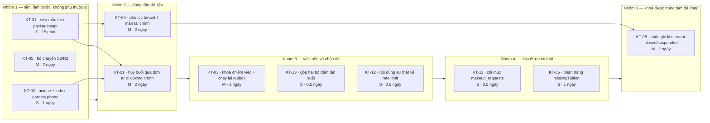
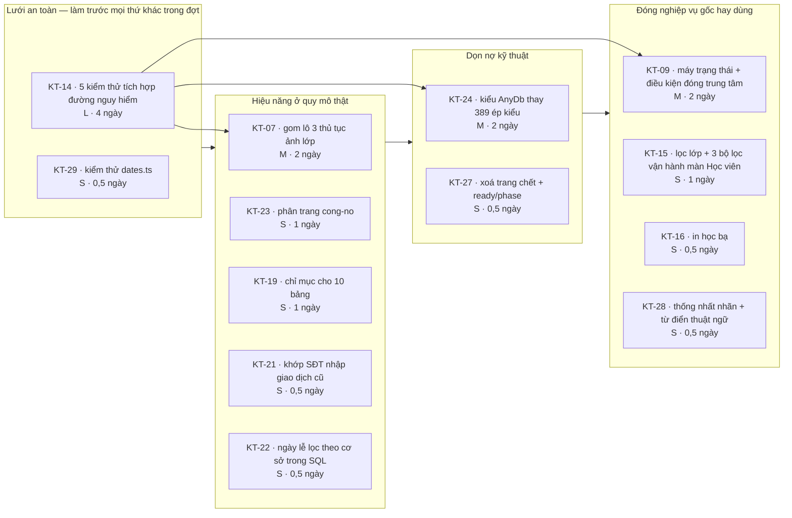
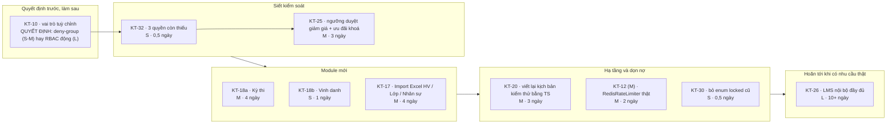

# Lộ trình hoàn thiện — Sata Robo Platform

_Lập ngày 18/09/2026, dựa trên 32 khoảng trống trong `docs/SO-KHOANG-TRONG.md`._
_Thiết kế hiện tại: `docs/THIET-KE-HE-THONG.md`. Đối sánh bản gốc: `docs/KHAO-SAT-GOC-2.md`._

## Nguyên tắc xếp đợt

- **Đợt 1 — Chạy thật được.** Chỉ những mục mà nếu không làm thì chạy thật sẽ **hỏng dữ liệu, mất dữ liệu, hoặc lộ dữ liệu**. Không nhận thêm việc gì khác vào đợt này.
- **Đợt 2 — Nâng chất lượng.** Hiệu năng ở quy mô thật, đóng nốt nghiệp vụ gốc hay dùng, dựng lưới an toàn kiểm thử.
- **Đợt 3 — Nâng cao.** Module mới và quyết định kiến trúc còn treo. Chỉ bắt đầu sau khi hệ thống đã chạy thật ổn định ít nhất một kỳ công.

Mỗi đợt có **tiêu chí nghiệm thu đo được** — nghĩa là có thể chạy một lệnh hoặc mở một màn hình rồi nói "đạt" hay "chưa đạt", không phải "thấy ổn".

## Tổng quan

| Đợt | Số mục | Ước lượng | Chặn go-live? |
|---|---|---|---|
| Đợt 1 — Chạy thật được | 11 mục | ~12–15 ngày công | Có |
| Đợt 2 — Nâng chất lượng | 12 mục | ~15–18 ngày công | Không |
| Đợt 3 — Nâng cao | 9 mục | ~25–30 ngày công | Không |

---

# Đợt 1 — Phải làm ngay để chạy thật được

**Danh sách mã số**: `KT-02` · `KT-05` · `KT-31` · `KT-01` · `KT-04` · `KT-03` · `KT-13` · `KT-12` · `KT-11` · `KT-06` · `KT-08`

## Thứ tự và phụ thuộc

**Vì sao thứ tự này**

- `KT-31` (một dòng) đứng trước `KT-01` và `KT-04` vì hai mục đó **phải kèm kiểm thử**, mà kiểm thử đặt trong `src/services/` sẽ không chạy nếu chưa sửa mẫu.
- `KT-02` đứng trước `KT-01` vì cả hai đều đụng migration SQL — gộp một lần chạy, một lần kiểm tra trên bản sao dữ liệu.
- `KT-04` đứng trước `KT-08` vì `KT-08` thêm chốt chặn theo tenant ở `trpc.ts`, làm sau khi lọc tenant ở tầng dữ liệu đã đúng thì dễ kiểm chứng hơn.
- `KT-05` không phụ thuộc gì nhưng phải xong **trước khi dựng môi trường thật**, vì nếu chọn Vercel thì mọi tệp tải lên sẽ mất — phát hiện muộn là mất dữ liệu thật.

## Chi tiết từng mục

| Mã | Việc | Cỡ | Chạm vào |
|---|---|---|---|
| `KT-02` | Dọn trùng + `UNIQUE INDEX parents_phone_uq`; `upsertParent` đổi sang `ON CONFLICT`; `findParentByPhone` không trả `null` khi trùng | S | `packages/db/sql/0001_constraints.sql`, `services/students.ts:368`, `services/parentPortal.ts:28` |
| `KT-05` | Nhánh S3-tương thích trong `storage.ts` (SigV4 bằng `fetch`, không thêm SDK); 4 biến môi trường vào bảng kiểm `/van-hanh` | M | `packages/api/src/storage.ts`, `packages/core/src/system/ops.ts`, `.env.example` |
| `KT-31` | `"test": "node --test --import tsx 'src/**/*.test.ts'"` | S | `packages/api/package.json:13` |
| `KT-01` | Xoá `hrSessionEffects.*`; `hrRequests` gọi `sessionChanges.cancelSession` / đổi giáo viên; thêm tham số `tx` cho `sessionChanges` | M | `services/hrSessionEffects.ts`, `services/hrRequests.ts:273,280`, `services/sessionChanges.ts` |
| `KT-04` | Thêm `tenantCol()` cho `refunds` + `commissions`; `tenantCond` + `canSeeFinanceDetailOf` + `redact` cho 4 hàm | M | `schema/finance.ts`, `sql/0005_nhuong_quyen.sql`, `services/finance.ts:1322,1374,1524`, `services/commissions.ts:114` |
| `KT-03` | Hai cột `locked_until` + `next_attempt_at`; chiếm việc bằng `FOR UPDATE SKIP LOCKED`; giãn cách luỹ thừa; thủ tục `system.replayOutbox` + nút ở `/van-hanh` | M | `schema/engagement.ts`, `services/engagement.ts:19-33`, `routers/system.ts`, `van-hanh/page.tsx` |
| `KT-13` | Xoá hai `Map` cục bộ, dùng `rateLimited` chung | S | `api/public/leads/route.ts:9-18`, `api/public/survey/[token]/route.ts:5-13` |
| `KT-12` | Sửa `admin.ts:624` nói đúng sự thật (bản S) hoặc viết `RedisRateLimiter` (bản M) | S–M | `services/admin.ts:621-626` |
| `KT-11` | 4 chỉ mục cho `makeup_requests` | S | `schema/academics.ts:476` |
| `KT-06` | `page` + `LIMIT 200` + bỏ 3 truy vấn con tương quan trong `missingTuition` | S | `services/finance.ts:1374`, `routers/finance.ts:144`, `thieu-hoc-phi/page.tsx` |
| `KT-08` | `tenantWriteAllowed(status, path)` ở core; chốt chặn trong `trpc.ts` | M | `core/org/tenant.ts`, `api/trpc.ts:40` |

## Tiêu chí nghiệm thu Đợt 1

Đo được, chạy được. Mỗi dòng phải xanh thì đợt mới coi là xong.

1. **`KT-02`** — `SELECT phone, count(*) FROM parents WHERE deleted_at IS NULL GROUP BY phone HAVING count(*) > 1;` trả **0 dòng**, và câu `CREATE UNIQUE INDEX` chạy không lỗi trên bản sao dữ liệu thật. Thêm: tạo thủ công 2 phụ huynh cùng số bằng SQL ⇒ bị CSDL từ chối.
2. **`KT-05`** — Đặt `S3_*`, tải một ảnh lớp qua `/media`, triển khai lại ứng dụng, **ảnh vẫn mở được**. Bỏ `S3_*` ở môi trường `production` ⇒ `/van-hanh` hiện cảnh báo mức "nguy hiểm".
3. **`KT-31`** — Tạo `packages/api/src/services/__probe.test.ts` cố tình `assert.fail()`; `pnpm --filter @satarobo/api test` **phải đỏ**. (Rồi xoá tệp đó.)
4. **`KT-01`** — Kiểm thử tích hợp: lớp 24 buổi → giáo viên nộp đơn "Nghỉ buổi dạy" buổi 10 → quản lý duyệt ⇒ `SELECT count(*) FROM sessions WHERE class_id = ? AND sequence_no <= 1000 AND status <> 'cancelled'` = **24**; buổi cũ có `sequence_no > 5000`, có `cancel_reason`, có `cancelled_by`; `classes.expected_end_date` đã dời. Kiểm thử này **phải nằm trong CI**.
5. **`KT-04`** — Kiểm thử ma trận: tenant `FRANCHISE` có `hoSeesFinanceDetail = false`; gọi `finance.debts`, `finance.missingTuition`, `finance.enrollmentDebts`, `finance.commissions` với tư cách SUPER_ADMIN chuỗi ⇒ **0 dòng** thuộc tenant đó. Cùng lời gọi với tư cách quản trị của chính tenant ⇒ **đủ dòng**.
6. **`KT-03`** — Chạy đồng thời `pnpm worker` và gọi `/api/cron/outbox` 20 lần trong 10 giây với 500 sự kiện chờ ⇒ `SELECT count(*) FROM user_notifications` đúng bằng số kỳ vọng (không nhân đôi). Một sự kiện cố tình lỗi ⇒ `next_attempt_at` giãn dần; bấm "Chạy lại" ở `/van-hanh` ⇒ `attempts` về 0 và sự kiện được xử lý.
7. **`KT-13`** — `grep -rn "new Map()" apps/web/src/app/api/` trả **0 kết quả** trong các tệp `route.ts`.
8. **`KT-12`** — Mở `/tich-hop` khi chưa đặt Redis: dòng "Rate limit" **không** ở trạng thái `ok`, và câu mô tả nói rõ bộ đếm nằm trong bộ nhớ từng tiến trình.
9. **`KT-11`** — `EXPLAIN SELECT * FROM makeup_requests WHERE status = 'requested' ORDER BY created_at DESC LIMIT 50;` dùng **Index Scan**, không phải Seq Scan.
10. **`KT-06`** — Với 2.000 ghi danh mẫu, `/thieu-hoc-phi` trả trong **< 1 giây** và có thanh phân trang; không còn truy vấn con tương quan trong `EXPLAIN`.
11. **`KT-08`** — Đặt tenant sang `closed`; nhân sự của tenant đó đăng nhập ⇒ đọc được, **mọi mutation trả FORBIDDEN** kèm câu tiếng Việt nêu lý do. Đặt sang `suspended` ⇒ chặn mutation, vẫn đọc và vẫn xem tài chính được.

**Cổng ra của Đợt 1**: CI xanh với các kiểm thử mới ở mục 4, 5, 6; và danh mục "Việc phải làm trước khi chạy pilot" trong `docs/CHECKLIST-DOI-SANH.md:112-123` được tick hết.

---

# Đợt 2 — Nâng chất lượng

**Danh sách mã số**: `KT-14` · `KT-07` · `KT-23` · `KT-19` · `KT-21` · `KT-22` · `KT-09` · `KT-15` · `KT-16` · `KT-28` · `KT-27` · `KT-29`

## Thứ tự và phụ thuộc

**Vì sao thứ tự này**

- `KT-14` đứng **đầu tiên**, trước cả việc sửa hiệu năng. Lý do: `KT-07` (gom lô ảnh) và `KT-24` (đổi kiểu ở 389 chỗ) đều là **viết lại mã đang chạy đúng** — không có kiểm thử thì hai việc đó là đánh bạc. Đầu tư 4 ngày kiểm thử trước sẽ trả về ngay trong chính đợt này.
- `KT-24` (dọn ép kiểu) phải sau `KT-14` vì nó chạm vào chữ ký của `writeAudit`/`emit` — tức là chạm vào mọi giao dịch trong hệ thống.
- `KT-09` sau `KT-08` của Đợt 1: Đợt 1 làm cho `closed` **có hiệu lực**, Đợt 2 làm cho việc **chuyển sang `closed`** có kiểm soát. Làm ngược thứ tự thì có luật chuyển trạng thái đẹp mà trạng thái vẫn không khoá được gì.
- Bốn mục của `P4` độc lập nhau, chia cho nhiều người làm song song được.

## Chi tiết từng mục

| Mã | Việc | Cỡ |
|---|---|---|
| `KT-14` | 5 kiểm thử tích hợp dùng `createCaller` + Postgres của CI: huỷ lớp dây chuyền · duyệt đơn nghỉ buổi dạy · đối soát rót tiền nhiều con · chốt kỳ công rồi thử ghi công · ma trận tenant 4 màn tài chính | L |
| `KT-29` | `packages/core/src/dates.test.ts` — biên qua tháng, qua năm, năm nhuận, múi giờ VN, khoảng chạm mép | S |
| `KT-07` | `submitMedia` / `restoreMedia` / `reviewMedia` nạp cả lô, một transaction, `INSERT` nhiều dòng | M |
| `KT-23` | `page` cho `debts` và `enrollmentDebts`, dùng `Pager` sẵn có | S |
| `KT-19` | Chỉ mục cho 10 bảng đã liệt kê; xác nhận thứ tự ưu tiên bằng `pg_stat_statements` trước | S |
| `KT-21` | Bỏ `right(regexp_replace(...))`, dùng `inArray(parents.phone, variants)` | S |
| `KT-22` | Thêm điều kiện cơ sở vào truy vấn `holidays` của `buildDays` | S |
| `KT-24` | Kiểu `Tx` / `AnyDb`; đổi chữ ký `writeAudit`, `emit`, `notify`, `deliverNotifications`; xoá 389 ép kiểu bằng tìm-thay | M |
| `KT-27` | Xoá `(admin)/[...slug]`, trường `ready`/`phase`, nhánh `!i.ready` | S |
| `KT-09` | `tenantTransition` + `tenantCloseCheck` theo khuôn `lockCheck` của kỳ công | M |
| `KT-15` | `classId` + `view: unplaced \| frequent_absent \| renewing` cho `students.list` | S |
| `KT-16` | Nút in + CSS `@media print` cho `/hoc-ba` | S |
| `KT-28` | Sửa 7 chỗ nhãn lệch; thêm mục "Từ điển thuật ngữ" vào `docs/THIET-KE-HE-THONG.md` | S |

## Tiêu chí nghiệm thu Đợt 2

1. **`KT-14`** — 5 kiểm thử tích hợp chạy trong CI, tổng thời gian **< 60 giây**. Cố tình hoàn nguyên bản vá `KT-01` ⇒ CI **phải đỏ**.
2. **`KT-29`** — `packages/core` đạt **0 hàm xuất không được nhắc trong kiểm thử** (chạy lại đúng kịch bản rà đã dùng cho sổ khoảng trống).
3. **`KT-07`** — Duyệt một lô **200 ảnh** của lớp 20 học viên hoàn tất trong **< 3 giây**; số `parent_notifications` sinh ra đúng bằng số cặp (ảnh × người giám hộ) như trước khi sửa.
4. **`KT-23`** — `/cong-no` với 8.000 dòng công nợ: trang đầu trả **< 1 giây**, có thanh phân trang, và tổng số dòng hiển thị đúng 8.000 (không bị cắt ở 5.000).
5. **`KT-19`** — Chạy kịch bản khói của CI, thu `pg_stat_statements`: **không còn Seq Scan** trên 10 bảng đã liệt kê.
6. **`KT-21`** — `EXPLAIN` của đường nhập giao dịch cũ dùng Index Scan trên `parents`.
7. **`KT-22`** — `EXPLAIN` của `buildDays` cho thấy truy vấn `holidays` có điều kiện `center_id`.
8. **`KT-24`** — `grep -rn "as unknown as" packages/api/src | wc -l` ≤ **10** (chỉ còn các chỗ thật sự cần). `pnpm -r typecheck` xanh.
9. **`KT-27`** — `grep -rn "ready" apps/web/src/lib/admin-nav.ts` trả **0 kết quả**; thư mục `(admin)/[...slug]` không còn.
10. **`KT-09`** — Thử `closed → active` ⇒ bị từ chối. Thử đóng tenant còn lớp `running` ⇒ trả danh sách vướng mắc bằng tiếng Việt, không ghi gì.
11. **`KT-15`** — `/students?view=unplaced` trả đúng tập "đang học nhưng chưa có ghi danh mở"; `/students?class=<id>` trả đúng sĩ số của lớp đó.
12. **`KT-16`** — Bấm In ở `/hoc-ba` ra một PDF không có menu, không có nền, ngắt trang đúng giữa các học bạ.
13. **`KT-28`** — `grep -rno "Đăng ký học" apps/web/src/app/\(admin\)` trả **0 kết quả**; `grep -rno "Tất cả cơ sở"` trả **0 kết quả**.

---

# Đợt 3 — Nâng cao

**Danh sách mã số**: `KT-10` · `KT-17` · `KT-18` · `KT-20` · `KT-25` · `KT-26` · `KT-30` · `KT-32` · `KT-12 (bản M)`

## Thứ tự và phụ thuộc

**Vì sao thứ tự này**

- `KT-10` là một **quyết định**, không phải một việc. Phải chốt trước khi làm `KT-32` và `KT-25`, vì cả hai đều thêm quyền mới — nếu chọn hướng "nhóm loại trừ" thì quyền mới khai khác cách so với hướng "RBAC động".
- `KT-30` (bỏ enum `locked` cũ) đặt ở Đợt 3 có chủ ý: chỉ làm **sau khi đã chạy thật ít nhất một kỳ công** để chắc chắn không còn dòng dữ liệu nào mang giá trị cũ.
- `KT-26` (LMS nội bộ) đặt cuối cùng và **được phép không làm**. Nó là module lớn nhất còn lại nhưng cũng là module ít gắn với dòng tiền và vận hành hằng ngày nhất.

## Quyết định phải chốt trước khi bắt đầu Đợt 3

**`KT-10` — vai trò tuỳ chỉnh.** Ba lựa chọn, chọn một và ghi lại quyết định vào `docs/THIET-KE-HE-THONG.md` mục QĐ-4:

| Lựa chọn | Công sức | Được | Mất |
|---|---|---|---|
| **A. Giữ nguyên** (vai trò tĩnh + nhóm cộng quyền) | 0 | An toàn nhất; kiểm được ở compile-time | Vẫn lệch bản gốc; mỗi vai trò mới là một lần triển khai |
| **B. Nhóm loại trừ** — thêm `effect: grant \| deny` vào `user_group_permissions` | S–M | Dựng được "vai trò hẹp" mà không động vào ma trận tĩnh; 90% nhu cầu thực tế | Giải thích quyền phức tạp hơn một bậc |
| **C. RBAC động thật** — bảng `roles` + `role_permissions` | L | Ngang bản gốc | Mất kiểm tra kiểu ở compile-time; phải viết màn quản trị + kiểm thử ma trận động; rủi ro tự cấp quyền |

**Khuyến nghị: B.** Nó đóng được khoảng trống thực tế (cấp ít hơn một vai trò có sẵn) với chi phí bằng một phần năm lựa chọn C, và giữ được lợi thế lớn nhất của thiết kế hiện tại là ma trận quyền đọc được từ mã.

## Chi tiết từng mục

| Mã | Việc | Cỡ |
|---|---|---|
| `KT-10` | Theo quyết định đã chốt ở trên | S–L |
| `KT-32` ✅ | **XONG 24/09/2026** — `student:change_code`, `lead:overwrite`, `student:export` / `lead:export`; kiểm ở `updateStudent`, `commitLeadImport`, `exportStudents`, `exportLeads`; giao diện ẩn nút / khoá ô tương ứng | S |
| `KT-25` ✅ | **XONG 24/09/2026** — cấu hình `discountApprovalPercent` (mặc định 20%, đặt 100 = tắt); đơn vượt ngưỡng vào `pending`, `recordPayment` từ chối cho tới khi người có `finance:approve` (khác người tạo đơn) duyệt; form tạo đơn cảnh báo trước, danh sách đơn có chip + lọc `?duyet=cho`. Chưa làm bảng `course_discounts` (ưu đãi khoá) — tách thành việc riêng | M |
| `KT-18a` | `exams` + `exam_registrations` + `exam_results`; gắn `orderItems.examId`; màn danh sách + đăng ký + nhập kết quả. Chưa làm thi trực tuyến | M |
| `KT-18b` | Bảng `honors` + trang danh sách + cấu hình danh hiệu | S |
| `KT-17` | Nhập Excel cho `/nhan-su` → `/students` → `/classes`, theo khuôn 3 bước của `/leads/import` | M |
| `KT-20` | Viết lại 2 kịch bản `.ps1` bằng TypeScript + `createCaller`; đưa vào CI | M |
| `KT-12` (M) | `RedisRateLimiter` cùng giao diện `hit/reset`, gọi REST Upstash bằng `fetch`, dự phòng về bộ nhớ khi lỗi | M |
| `KT-30` ✅ | **XONG 24/09/2026** — `packages/db/sql/0015_don_enum_ky_cong.sql` đổi dữ liệu rồi dựng lại enum không còn `locked`; `PERIOD_STATUS_LEGACY` đã xoá khỏi mã (đo lại trên máy thật: 0 nhãn cũ, 0 dòng cũ) | S |
| `KT-26` | Hoãn — chỉ làm khi có nhu cầu đào tạo nội bộ thật | L |

## Tiêu chí nghiệm thu Đợt 3

1. **`KT-10`** — Quyết định được ghi vào `docs/THIET-KE-HE-THONG.md` QĐ-4 kèm ngày và người quyết. Nếu chọn B: dựng được một "vai trò Lễ tân" bằng `CENTER_CLASS_MANAGER` + nhóm `deny` cho `finance:*` và `student:update`; kiểm thử ma trận chứng minh người đó **không** ghi nhận được thanh toán.
2. **`KT-32`** — Người chỉ có `student:update` (không có `student:change_code`) sửa hồ sơ thì được, đổi mã học viên thì bị `FORBIDDEN`. Tương tự cho `lead:overwrite` và `*:export`.
3. **`KT-25`** — Giảm 60% trên một dòng đơn (vượt ngưỡng cấu hình) ⇒ đơn vào trạng thái chờ duyệt; người không có `finance:approve` **không ghi nhận được khoản thu** cho đơn đó.
4. **`KT-18a`** — Tạo một kỳ thi, đăng ký 10 học viên, tạo đơn loại `exam` cho từng em, nhập kết quả; `/orders?type=exam` khớp đúng 10 đơn với 10 đăng ký.
5. **`KT-18b`** — Tạo một đợt vinh danh, gắn 5 học viên, hiển thị trên hồ sơ học viên.
6. **`KT-17`** — Nhập một tệp `.xlsx` 200 nhân sự: ba nhóm Hợp lệ / Trùng / Lỗi hiện đúng; ghi thật xong `SELECT count(*) FROM staff` tăng đúng số dòng hợp lệ; chạy lại cùng tệp ⇒ **0 dòng mới** (idempotent).
7. **`KT-20`** — CI trên `ubuntu-latest` chạy được kịch bản toàn diện và kịch bản vai trò; hai tệp `.ps1` đã xoá.
8. **`KT-12` (M)** — Đặt `UPSTASH_REDIS_REST_URL`, chạy hai phiên bản ứng dụng, bắn 10 yêu cầu OTP qua cả hai ⇒ tổng bị chặn đúng ở ngưỡng chung, không phải ngưỡng × 2.
9. **`KT-30`** — `SELECT count(*) FROM timesheet_periods WHERE status = 'locked'` trả **0**; `PERIOD_STATUS_LEGACY` không còn trong mã.

---

# Phụ lục — bảng tra mã số

| Mã | Tên ngắn | Mức | Cỡ | Đợt |
|---|---|---|---|---|
| KT-01 | Huỷ buổi qua đơn từ đi đường tắt, lớp mất buổi | Chặn vận hành | M | 1 |
| KT-02 | `parents.phone` không unique, không index | Chặn vận hành | S | 1 |
| KT-03 | Outbox không khoá chiếm việc, không chạy lại được | Chặn vận hành | M | 1 |
| KT-04 | Lọc tenant chưa phủ 4 màn tài chính | Chặn vận hành | M | 1 |
| KT-05 | Chưa có bộ chuyển S3/R2 | Chặn vận hành | M | 1 |
| KT-06 | `missingTuition` không phân trang | Cao | S | 1 |
| KT-07 | Ba thủ tục ảnh lớp là N+1 | Cao | M | 2 |
| KT-08 | Trạng thái tenant không khoá được gì | Cao | M | 1 |
| KT-09 | Đổi trạng thái tenant không có máy trạng thái | Cao | M | 2 |
| KT-10 | Không tạo được vai trò tuỳ chỉnh | Cao | L | 3 |
| KT-11 | `makeup_requests` không có chỉ mục | Cao | S | 1 |
| KT-12 | `/tich-hop` báo sai về rate limit | Cao | M | 1 (S) / 3 (M) |
| KT-13 | Hai bộ đếm tần suất song song, `Map` rò rỉ | Cao | S | 1 |
| KT-14 | 0 kiểm thử cho 25.978 dòng dịch vụ | Cao | L | 2 |
| KT-15 | Màn Học viên thiếu 4 bộ lọc | Trung bình | S | 2 |
| KT-16 | Học bạ không in được | Trung bình | S | 2 |
| KT-17 | Không nhập Excel HV / Lớp / Nhân sự | Trung bình | M | 3 |
| KT-18 | Thiếu Kỳ thi, Ngân hàng câu hỏi, Vinh danh | Trung bình | L | 3 |
| KT-19 | 32 bảng không có chỉ mục | Trung bình | S | 2 |
| KT-20 | Kịch bản kiểm thử chỉ chạy trên Windows | Trung bình | M | 3 |
| KT-21 | Khớp SĐT bằng hàm trên cột | Trung bình | S | 2 |
| KT-22 | `buildDays` nạp ngày lễ mọi cơ sở | Trung bình | S | 2 |
| KT-23 | `/cong-no` không phân trang | Trung bình | S | 2 |
| KT-24 | 389 chỗ `as unknown as Db` | Trung bình | M | 2 |
| KT-25 | Không có duyệt giảm giá / ưu đãi khoá | Trung bình | M | 3 |
| KT-26 | LMS nội bộ chỉ có 2/18 phần | Trung bình | L | 3 (hoãn) |
| KT-27 | Trang `[...slug]` và `ready`/`phase` đã chết | Thấp | S | 2 |
| KT-28 | Nhãn không nhất quán | Thấp | S | 2 |
| KT-29 | `dates.ts` gần như không có kiểm thử | Thấp | S | 2 |
| KT-30 | Enum `locked` cũ còn sót | Thấp | S | 3 |
| KT-31 | Mẫu `test` của `packages/api` một cấp | Thấp | S | 1 |
| KT-32 | Thiếu 3 quyền tinh vi so với bản gốc | Thấp | S | 3 |
