# Thiết kế hệ thống Sata Robo Platform

_Viết cho người kế nhiệm: đọc hết tài liệu này là hiểu hệ thống chạy thế nào mà không phải hỏi ai._
_Ngày lập: 18/09/2026. Mọi khẳng định đều kèm `đường-dẫn-tệp:dòng` để kiểm chứng lại trên mã nguồn._

Tài liệu đi kèm:
- `docs/KHAO-SAT-GOC-2.md` — khảo sát bản gốc admin.satarobo.vn (nguồn sự thật về nghiệp vụ gốc).
- `docs/SO-KHOANG-TRONG.md` — sổ khoảng trống (những chỗ chưa hoàn thiện, xếp theo mức ảnh hưởng).
- `docs/LO-TRINH-HOAN-THIEN.md` — lộ trình 3 đợt để đóng các khoảng trống đó.

---

## 1. Bản đồ kiến trúc

### 1.1. Bốn gói và ranh giới trách nhiệm

Kho mã là **monorepo pnpm + turbo** (`package.json:1-40`, `pnpm-workspace.yaml`). Bốn gói, ranh giới cứng:

| Gói | Đường dẫn | Trách nhiệm | KHÔNG được làm |
|---|---|---|---|
| `@satarobo/core` | `packages/core/src/**` (12.075 dòng mã + 55 tệp kiểm thử) | Quy tắc nghiệp vụ **thuần**: máy trạng thái, công thức tiền, phân quyền, chuẩn hoá dữ liệu | Không biết CSDL, không biết HTTP, không đọc biến môi trường ngoài `process.env` được truyền vào |
| `@satarobo/db` | `packages/db/src/**` (169 bảng, 4.063 dòng schema) | Khai báo bảng Drizzle, ràng buộc, seed, migration SQL | Không chứa quy tắc nghiệp vụ |
| `@satarobo/api` | `packages/api/src/**` (23 router, 74 dịch vụ, 25.978 dòng) | Kiểm quyền → gọi core → transaction → ghi nhật ký → trả read-model | Không render, không chứa công thức (công thức nằm ở core) |
| `@satarobo/web` | `apps/web/src/**` (156 trang quản trị) | Render, gọi tRPC | Không chứa quy tắc nghiệp vụ |

Quy ước này được nêu trong `docs/ARCHITECTURE.md:18-23` và **được giữ đúng trong mã**: mọi công thức tiền nằm ở `packages/core/src/finance/rules.ts`, mọi bảng chuyển trạng thái nằm ở `packages/core/src/*/lifecycle.ts` hoặc `stateMachine.ts`.

### 1.2. Một yêu cầu đi từ trình duyệt tới Postgres

```mermaid
sequenceDiagram
    autonumber
    participant B as Trình duyệt / App GV / Cổng PH
    participant N as Next.js route handler<br/>(apps/web/src/app/api/trpc)
    participant C as createContext<br/>(packages/api/src/context.ts:71)
    participant P as protectedProcedure<br/>(packages/api/src/trpc.ts:40)
    participant S as Service<br/>(packages/api/src/services/*.ts)
    participant K as Core rules<br/>(packages/core/src/**)
    participant D as Drizzle → Postgres

    B->>N: POST /api/trpc/finance.recordPayment
    N->>C: headers (Authorization Bearer / cookie x-dev-actor)
    C->>D: users → user_roles → teachers/parents → staff_deployments → user_group_permissions
    C->>K: activeRoleAssignments() · widenByDeployments() · tenantScope()
    C-->>P: Context { db, actor, user, tenantId, tenantIds, tenants }
    P->>P: chưa đăng nhập ⇒ UNAUTHORIZED · chưa 2FA ⇒ FORBIDDEN (trpc.ts:41-42)
    P->>S: input đã qua zod
    S->>K: requirePermission(ctx, "finance:create", { centerId })
    S->>K: priceLines() · validateInstallmentPlan() · orderBalance()
    S->>D: db.transaction(tx => { nghiệp vụ; writeAudit(tx,…); emit(tx, event) })
    D-->>S: rows
    S-->>B: read-model (đã che PII theo quyền + theo tenant)
```

**Bốn chốt chặn, theo đúng thứ tự trong một yêu cầu:**

1. **Xác thực** — `packages/api/src/context.ts:78-97`. Ưu tiên Supabase JWT (`Authorization: Bearer`); nếu không có và `devActorAllowed(process.env)` bật thì nhận cookie tài khoản mẫu. Cửa hậu bị khoá cứng ở `packages/core/src/security/devActor.ts` — không bao giờ nhận khi `NODE_ENV=production` (ghi rõ ở `context.ts:90-93`).
2. **Bắt buộc 2 lớp** — `packages/api/src/trpc.ts:42`: `ctx.auth.mfa.required && !satisfied` chặn mọi thủ tục trừ `auth.*`. Vai trò nào bắt buộc lấy từ `REQUIRE_MFA_ROLES` (`context.ts:147`).
3. **Kiểm quyền** — trong **service**, không phải router: `requirePermission(ctx, perm, { centerId, ownerIds })` (`packages/api/src/trpc.ts:49-51`) gọi `assertAuthorized` của `packages/core/src/policy/policy.ts:186-189`. 124 chuỗi quyền khác nhau đang được kiểm.
4. **Lọc trung tâm (tenant)** — `tenantCond(ctx, bang)` thêm vào `WHERE` (`packages/api/src/services/tenantScope.ts:24-33`); nạp theo id thì `assertTenant(ctx, row)` (`tenantScope.ts:66-68`); trả ra ngoài thì `redact(ctx, row)` che PII (`tenantScope.ts:108-118`).

**Nhật ký** ghi ở đâu: `writeAudit(tx, …)` — `packages/api/src/services/audit.ts:21-35`. Điểm mấu chốt là nó nhận `tx` chứ không nhận `db`, nên bản ghi nhật ký **nằm trong cùng transaction với nghiệp vụ**: nghiệp vụ rollback thì nhật ký cũng rollback, nghiệp vụ thành công thì không bao giờ mất nhật ký. Bảng `audit_log` chỉ-thêm, chặn bằng trigger ở tầng CSDL (`packages/db/sql/0001_constraints.sql:31-39`).

**Sự kiện miền** ghi vào `outbox` cũng trong cùng transaction: `emit(tx, event)` — `packages/api/src/services/outbox.ts:5-8`. Worker đọc ra sau (mục 1.4).

### 1.3. Đường ghi có giao dịch

Mẫu chuẩn lặp lại ở mọi dịch vụ ghi (ví dụ `packages/api/src/services/sessionChanges.ts:cancelSession`):

```
requirePermission            → quyền
core.validate*/…             → quy tắc thuần, trả danh sách lỗi tiếng Việt
db.transaction(async tx => {
   set constraints … deferred   ← khi xếp lại nhiều buổi (0001_constraints.sql:13)
   UPDATE … WHERE id = ? AND status IN (…) AND not exists(điểm danh)   ← chống tranh chấp
   if (!updated.length) throw CONFLICT "Buổi vừa thay đổi — tải lại trang"
   writeAudit(tx, …)
   emit(tx, domainEvent)
   deliverNotifications(tx, …)
})
```

Chống ghi đè đồng thời làm theo hai cách:
- **Điều kiện trong `WHERE`** (lạc quan, không cần cột phiên bản) — ví dụ `sessionChanges.ts` huỷ buổi.
- **Cột phiên bản** — `finance.updatePendingPayment` và `finance.adjustConfirmedPayment` bắt buộc `version` trong input (`packages/api/src/routers/finance.ts:120, 125`), khớp câu chữ của bản gốc "Người khác vừa sửa khoản này. Đang tải lại…" (`docs/KHAO-SAT-GOC-2.md:325`).

### 1.4. Việc nền

Hai đường chạy cùng một tập hàm:
- **Tự dựng**: `pnpm worker` → vòng lặp 10 giây, `packages/api/src/worker.ts:30-77`.
- **Vercel**: `GET /api/cron/outbox` mỗi phút, bảo vệ bằng `CRON_SECRET` so khớp không lệ thuộc thời gian (`apps/web/src/app/api/cron/outbox/route.ts:6-27`).

Chuỗi việc mỗi nhịp: `scanLeadSla` → `processOutbox` → `syncInvoiceDrafts` → `dispatchParentMessages` (ZNS/SMS) → `dispatchPush` → `processEmailQueue` → (15 phút) đăng bài, nhắc bài tập, thưởng giới thiệu, mời khảo sát, cảnh báo "cần thực hiện" → (24 giờ) dọn nhật ký đăng nhập, quét lưu trữ NĐ13, nhắc hết bảo lưu → `recordHeartbeat`.

`processOutbox` (`packages/api/src/services/engagement.ts:19-33`): lấy tối đa 200 sự kiện chưa xử lý, `attempts < 5`; chạy luật `runRules` của core; thành công thì đóng `processedAt`, lỗi thì `attempts + 1` và ghi `lastError`.

> ⚠ Chỗ này còn hai điểm yếu — xem `KT-03` trong `docs/SO-KHOANG-TRONG.md`: không có khoá chiếm việc (`FOR UPDATE SKIP LOCKED`) nên worker và cron chạy song song sẽ xử lý trùng, và sự kiện hỏng quá 5 lần nằm lại vĩnh viễn không có đường chạy lại.

### 1.5. Tệp và ảnh

`packages/api/src/storage.ts:11-40` — khoá đối tượng được kiểm bằng `isSafeObjectKey` (chặn `..`, `//`, đường dẫn tuyệt đối), rồi kiểm lần hai bằng `path.resolve` phải nằm trong thư mục gốc. Ảnh **không bao giờ công khai**: phát qua URL ký HMAC có hạn (mặc định 15 phút), `signedMediaUrl` / `verifyMediaSignature`.

Kho mặc định là **đĩa cục bộ** (`STORAGE_DIR`, `storage.ts:11`). Bộ chuyển R2/S3 chưa được viết — xem `KT-05` trong sổ khoảng trống.

---

## 2. Mô hình dữ liệu theo miền

169 bảng, chia 6 miền. Nguyên tắc chung áp cho mọi bảng:
- Khoá chính UUID (`packages/db/src/schema/_common.ts`), `createdAt`/`updatedAt` chuẩn, một số bảng có `deletedAt` (xoá mềm).
- **42 bảng mang cột `tenant_id`** (`tenantCol()`, `packages/db/src/schema/tenant.ts:74`) — cột này để lọc rẻ bằng một chỉ mục; trigger `fill_tenant_id` (`packages/db/sql/0005_nhuong_quyen.sql`) tự điền theo cơ sở của dòng nên mọi đường ghi cũ chạy y như trước khi có nhượng quyền.
- Bảng nào là **sổ cái** thì chỉ-thêm, chặn bằng trigger: `audit_log`, `finance_ledger`, `attendance_punches`, `stock_movements`, `coin_transactions`, `document_versions`, `consent_records`, `lead_distribution_log`, `lead_pool_events` (`packages/db/sql/0001_constraints.sql:31-39, 50-57, 78-85, 121-129, 154-160, 163-169, 207-211`).

### 2.1. Tuyển sinh (admissions — 14 bảng)

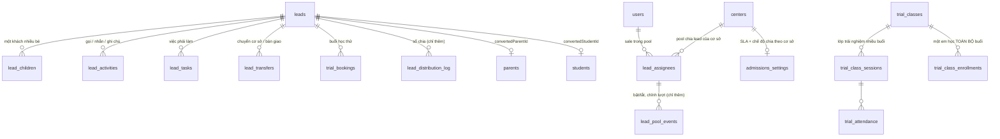

**Vì sao thiết kế như vậy**

- `leads.phone_normalized` là cột riêng, có chỉ mục `leads_phone_idx` (`packages/db/src/schema/admissions.ts`, khối `leads`). Khử trùng SĐT là nghiệp vụ lõi ("Số này đã có trong hệ thống — đã thêm bé vào khách cũ", `docs/KHAO-SAT-GOC-2.md:100`); nếu chuẩn hoá lúc truy vấn thì chỉ mục vô dụng, nên chuẩn hoá lúc ghi.
- `lead_children` tách khỏi `leads` vì một phụ huynh nhiều con là chuyện thường; bản gốc có "Tên bé thứ N" (`KHAO-SAT-GOC-2.md:97`). Gộp vào một bảng thì không chốt được từng bé một.
- `lead_assignees` (pool) tách khỏi `user_roles` vì "đang nhận / tạm nghỉ / chưa từng được chia" là trạng thái **vận hành**, không phải quyền. Quy tắc gốc: tắt thì "bộ đếm lượt đóng băng, không bị xoá"; bật lại thì "lượt được đặt về mức thấp nhất của những người đang nhận" (`KHAO-SAT-GOC-2.md:124-125`) — cài ở `packages/api/src/services/admissionsAdmin.ts:255-281`.
- `lead_distribution_log` và `lead_pool_events` chỉ-thêm để trả lời được câu "vì sao lead này về tay người đó" sau nhiều tháng.
- `trial_classes` tách hẳn khỏi `classes`: lớp trải nghiệm có luật riêng (tên tự đặt, mỗi buổi khác ngày/giờ/phòng/GV, thêm một em là học toàn bộ buổi kể cả buổi tạo sau — `KHAO-SAT-GOC-2.md:144-149`). Nhét chung vào `classes` sẽ làm bẩn máy trạng thái lớp thật.

### 2.2. Học vụ (academics + people — 30 bảng)

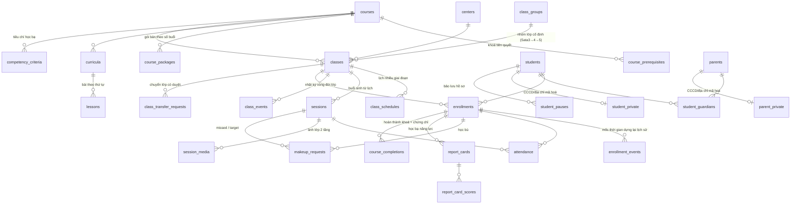

**Vì sao thiết kế như vậy**

- **"Lịch học là dữ liệu"** (ADR-002, `docs/ARCHITECTURE.md:28`): `class_schedules` mô tả quy tắc (thứ mấy, mấy giờ, phòng, GV, hiệu lực từ–đến), `sessions` là các buổi đã sinh ra. Nhờ tách, đổi lịch giữa khoá là thêm một giai đoạn chứ không sửa từng buổi, và dò lệch lịch (`/classes/kiem-tra-lich`, `KHAO-SAT-GOC-2.md:195-197`) trở thành một phép so hai tập.
- `sessions` có khoá duy nhất `(class_id, sequence_no)` (`packages/db/src/schema/academics.ts`, khối `sessions`). Vì số buổi phải duy nhất mà buổi huỷ vẫn phải giữ lại, hệ thống dùng **ba dải số**: 1..1000 buổi chính thức, 1001+ buổi ngoài lộ trình, **5001+ buổi đã huỷ có dời bù** (`packages/core/src/classes/lifecycle.ts:110-133`). Buổi thay thế dùng lại đúng số buổi cũ ⇒ tổng số buổi của lớp không đổi, đúng cam kết "huỷ kiểu dời giữ đủ tổng buổi" (`docs/CHECKLIST-DOI-SANH.md:51`).
- Hai ràng buộc EXCLUDE ở CSDL chặn trùng phòng và trùng giáo viên theo khoảng thời gian (`packages/db/sql/0001_constraints.sql:6-22`), khai `DEFERRABLE` để khi xếp lại cả lớp thì hoãn kiểm tới cuối transaction.
- `enrollments` là "hợp đồng học": gói bao nhiêu buổi, đã tiêu bao nhiêu. Công nợ, sắp hết khoá, hoàn tiền đều suy từ đây + `attendance`, không lưu số dư riêng ⇒ không có chuyện hai con số đá nhau.
- Số buổi đã tiêu tính bằng SQL, không lưu cột: `consumedSql` ở `packages/api/src/services/students.ts:23` đếm `attendance` trạng thái `present | late | absent_unexcused` cộng `carriedSessions` (buổi mang sang khi chuyển lớp). Vắng **có phép** không tiêu buổi — đây là quy tắc tiền, không phải quy tắc chuyên cần.
- PII tách bảng (`student_private`, `parent_private`, `staff_private`, `order_private`) — ADR-005. Lý do thực dụng: `SELECT *` vô tình sẽ không kéo CCCD/địa chỉ ra, và chỉ đường nào cố ý join mới cần audit `PII_REVEAL`.

### 2.3. Tài chính (finance + einvoice — 23 bảng)

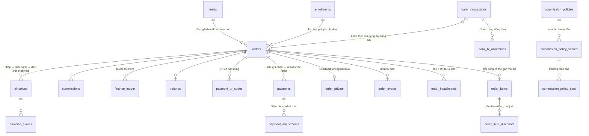

**Vì sao thiết kế như vậy**

- **Hai bước thu tiền** là cột sống: `payments.status` đi `recorded` → `confirmed | rejected | voided` (`packages/core/src/finance/rules.ts:21-23`). Công nợ chỉ trừ khoản **đã xác nhận** (`orderBalance`, `rules.ts:468-475`) nhưng badge hiển thị lại tính cả khoản chờ ("tiền đã về là đã về", `rules.ts:537-563`) — đúng hai cột "Thiếu — PH đang thấy" và "Thiếu thật" của bản gốc (`KHAO-SAT-GOC-2.md:330`).
- `finance_ledger` chỉ-thêm (`0001_constraints.sql:50-57`): sửa tiền không bao giờ là `UPDATE`, mà là một bút toán điều chỉnh mới. Nhờ vậy số liệu kế toán dựng lại được tại bất kỳ mốc thời gian nào.
- Ràng buộc tiền ở CSDL chứ không chỉ ở ứng dụng: `orders.total = subtotal - discount_amount`, `payments.amount > 0`, `refunds.amount <= proposed_amount`, `bank_transactions` trạng thái `matched` bắt buộc có `order_id` và `payment_id` (`0001_constraints.sql:60-71`).
- `commissions` có `parent_id` tự trỏ: dòng thu hồi (clawback) là một dòng con âm, không sửa dòng gốc. Ràng buộc dấu được kiểm ở CSDL (`0001_constraints.sql:72-73`), thực thi ở `packages/api/src/services/commissions.ts:adjustCommissionsForRefund`.
- `payment_qr_codes` có trạng thái + hạn dùng vì bản gốc yêu cầu "QR đã hết hạn" / "Đang dùng lại mã QR còn hiệu lực" (`KHAO-SAT-GOC-2.md:313`). Luật dùng lại nằm ở `packages/core/src/finance/rules.ts:750-776`: chỉ dùng lại mã còn hiệu lực, chưa dùng và **đúng số tiền đang phải thu**.
- `einvoices` khoá cứng ở tầng CSDL sau khi phát hành — trigger `einvoices_lock_issued` cấm sửa nội dung/số/ngày và cấm xoá (`0001_constraints.sql:184-205`).

### 2.4. Nhân sự & chấm công (hr — 15 bảng)

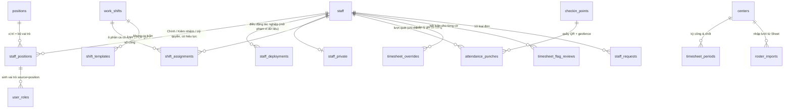

**Vì sao thiết kế như vậy**

- **Nguyên tắc vàng của chấm công**: "Công đếm theo lịch đã xếp; lượt quét chỉ sinh cờ để quản lý rà" (`KHAO-SAT-GOC-2.md:252`). Vì vậy `attendance_punches` không bao giờ trừ công — nó chỉ-thêm và mang mảng cờ; số công của một ngày do `computeDay` tính từ **ô phân ca** (`packages/core/src/hr/rules.ts:352`), và chỉ `timesheet_overrides` mới đổi được.
- `shift_assignments` lưu **ảnh chụp** `unitsSnapshot / minutesSnapshot / segmentsSnapshot` lúc xếp ca (`packages/api/src/services/hrShared.ts:117-132`). Đây là cách cài "Đổi giờ/số công chỉ áp cho ô xếp SAU khi lưu — lịch đã xếp giữ nguyên" (`KHAO-SAT-GOC-2.md:270`). Nếu đọc thẳng `work_shifts` thì sửa một mã ca sẽ viết lại lịch sử công của cả năm.
- `positions` ↔ `staff_positions` ↔ `user_roles(source = "position")`: triết lý gốc "Quyền gắn theo vị trí, không gắn theo người" (`KHAO-SAT-GOC-2.md:238`). `user_roles` có `valid_from/valid_to` nên **hết hạn là quyền tự tắt ở lần truy cập kế tiếp** — không cần ai đi gỡ (`packages/api/src/context.ts:110-117`).
- `staff_deployments` tách khỏi `staff_positions` vì điều động là **tác nghiệp** (mở tạm phạm vi dữ liệu của cơ sở khác), không phải phân công (`context.ts:118-125` gọi `widenByDeployments`).
- 19 cờ chấm công khai đủ trong `packages/core/src/hr/rules.ts:243-249`, khớp trọn bộ cờ của bản gốc (`KHAO-SAT-GOC-2.md:254-256`); 15 cờ trong đó là "cần rà" (`REVIEWABLE_FLAGS`, `rules.ts:260-264`).

### 2.5. Vận hành & chăm sóc (care, engagement, outreach, inventory, content — 47 bảng)

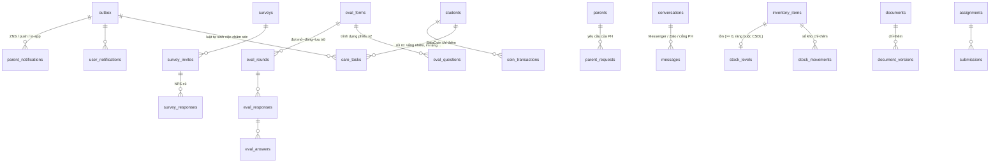

Điểm thiết kế đáng chú ý: **mọi thứ đếm được đều là sổ chỉ-thêm + một bảng tồn**, và tồn có ràng buộc `>= 0` ở CSDL (`stock_levels_nonneg_check`, `coin_tx_check`, `0001_constraints.sql:130-137`). Nhờ vậy sai lệch kho/xu không bao giờ âm lặng lẽ, và luôn truy lại được từng bước.

### 2.6. Hệ thống & nhượng quyền (identity, tenant, org, system, migration — 27 bảng)

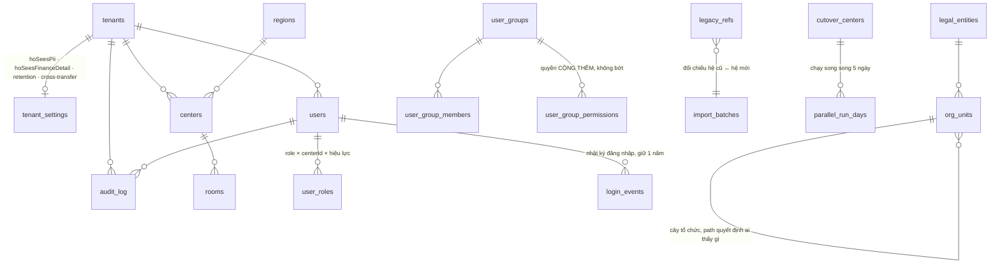

**Vì sao thiết kế như vậy**

- `tenants` là **đơn vị cách ly cao nhất**, đứng trên `centers`. `OWNED` = chuỗi tự vận hành (Hội sở nhìn xuyên suốt); `FRANCHISE` = bên nhận nhượng quyền, dữ liệu riêng tư (`packages/db/src/schema/tenant.ts:9-20`). Công tắc chia sẻ nằm ở `tenant_settings` và **chỉ quản trị của chính trung tâm đó mới bật được** — Hội sở chuỗi không tự mở (`packages/api/src/services/tenants.ts:118-123`).
- `org_units` (cây tổ chức) tồn tại **song song** với `centers` chứ không thay thế: bản gốc quy định "đổi đơn vị cha tính lại path cả nhánh con và path quyết định ai thấy dữ liệu cơ sở nào" (`KHAO-SAT-GOC-2.md:401-402`). Giữ `centers` riêng để bộ phân quyền theo `centerId` không phải viết lại.
- `user_group_permissions` chỉ **cộng thêm** quyền, không bao giờ bớt (`packages/core/src/policy/policy.ts:135, 158-167`). Đây là cách cài "Cấp quyền cho một nhóm người mà không sửa vai trò" (`KHAO-SAT-GOC-2.md:406`) mà không phá được ma trận vai trò.

---

## 3. Các máy trạng thái

Mười máy trạng thái. Mỗi máy: bảng chuyển hợp lệ nằm ở core, kiểm quyền nằm ở service.

### 3.1. Lead — `packages/core/src/admissions/leadMachine.ts:41-53`

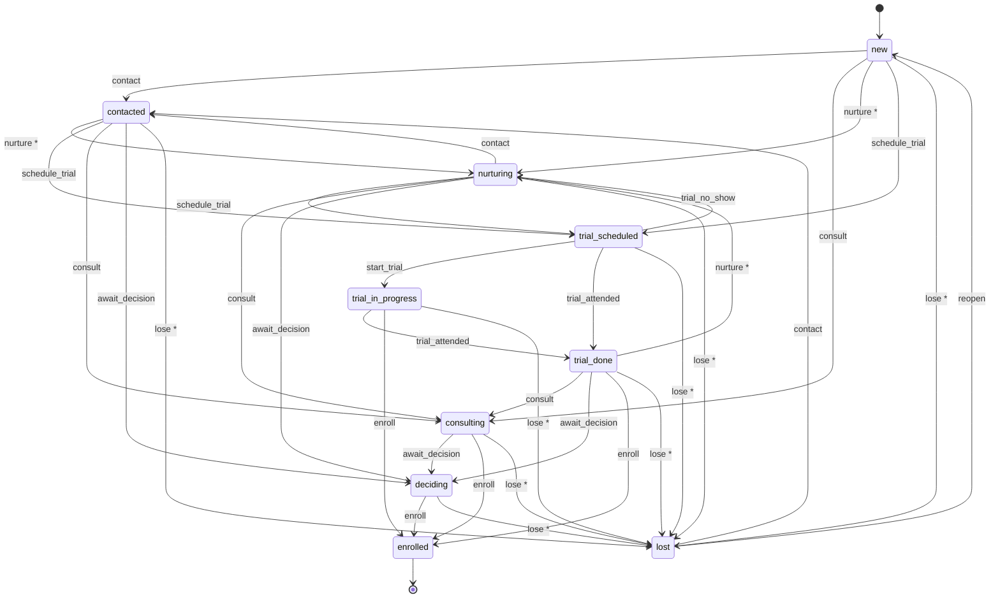

`*` = **bắt buộc lý do 3–500 ký tự** (`LEAD_DROP_EVENTS`, `leadMachine.ts:61-64`), đúng câu chữ gốc "Lead rời phễu ở bước này. Ghi lý do để báo cáo biết vì sao mất, không chỉ biết mất ở bậc nào" (`KHAO-SAT-GOC-2.md:90`).

**Ai được chuyển**: `lead:update` hoặc `lead:update_own` ở đúng cơ sở. Sự kiện `enroll` **không nằm** trong `MANUAL_LEAD_EVENTS` (`leadMachine.ts:67`) và cũng không nằm trong enum zod của router (`packages/api/src/routers/admissions.ts`), nên chốt lead chỉ đi qua màn Chuyển đổi — đúng bản gốc.

**Đối chiếu bản gốc**: **khớp**. 10 trạng thái của gốc (`MOI, DA_LIEN_HE, DANG_TU_VAN, DA_HEN_HOC_THU, DANG_HOC_THU, DA_HOC_THU, CHO_QUYET_DINH, DA_DANG_KY, DANG_NUOI_DUONG, DA_MAT`, `KHAO-SAT-GOC-2.md:83-84`) ánh xạ 1-1. Khác biệt có chủ ý: bản gốc cho chọn **bất kỳ** trạng thái, bản mới ràng theo bảng luật + gắn SLA theo trạng thái (`DEFAULT_SLA`, `leadMachine.ts:144-158`).

### 3.2. Buổi học — `packages/core/src/sessions/stateMachine.ts:21-31`

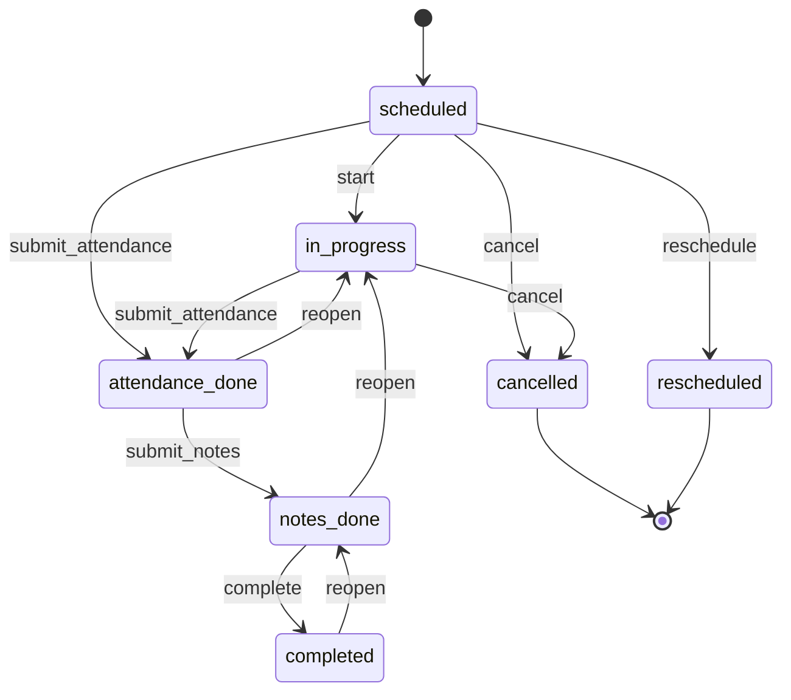

**Điều kiện chuyển (guards)** — `stateMachine.ts:88-113`:
- `start` / `submit_attendance`: buổi **chưa diễn ra** thì cấm (`sessionDate > today`).
- `submit_attendance`: phải điểm danh **đủ** mọi học viên đang active, báo rõ `(đã/tổng)`.
- `complete`: đi qua `completionBlockers` (`stateMachine.ts:200-206`) — 6 điều kiện tự tick theo dữ liệu thật: điểm danh đủ · xác nhận bài đã dạy · nhận xét chung · nhận xét từng em có mặt (bật/tắt theo cơ sở) · ảnh lớp (bật/tắt theo cơ sở) · checklist sau buổi.

**Ai được chuyển**: giáo viên chủ nhiệm buổi (`session:update_own` + là chủ sở hữu) hoặc giáo vụ/quản lý cơ sở (`session:*`). Huỷ và điều chỉnh **không đi qua đây** — router chặn hai sự kiện `cancel`/`reschedule` ở `packages/api/src/routers/academics.ts:57`, chúng đi luồng riêng `sessions.cancel` / `sessions.adjust` để có lý do, dời bù, thông báo.

**Đối chiếu bản gốc**: **khớp và làm hơn**. Gốc có checklist 9 bước ở giao diện; bản mới biến thành 6 điều kiện tính từ dữ liệu, bật/tắt được theo cơ sở (`docs/CHECKLIST-DOI-SANH.md:52`). Tình trạng buổi hiển thị của gốc ("Chưa hoàn tất · Sắp tới hôm nay · Chưa tới giờ · Đã hoàn tất · Lớp không còn học viên · Đã huỷ", `KHAO-SAT-GOC-2.md:207`) suy được từ `status` + `date` + sĩ số.

### 3.3. Lớp — `packages/core/src/classes/lifecycle.ts:26-35`

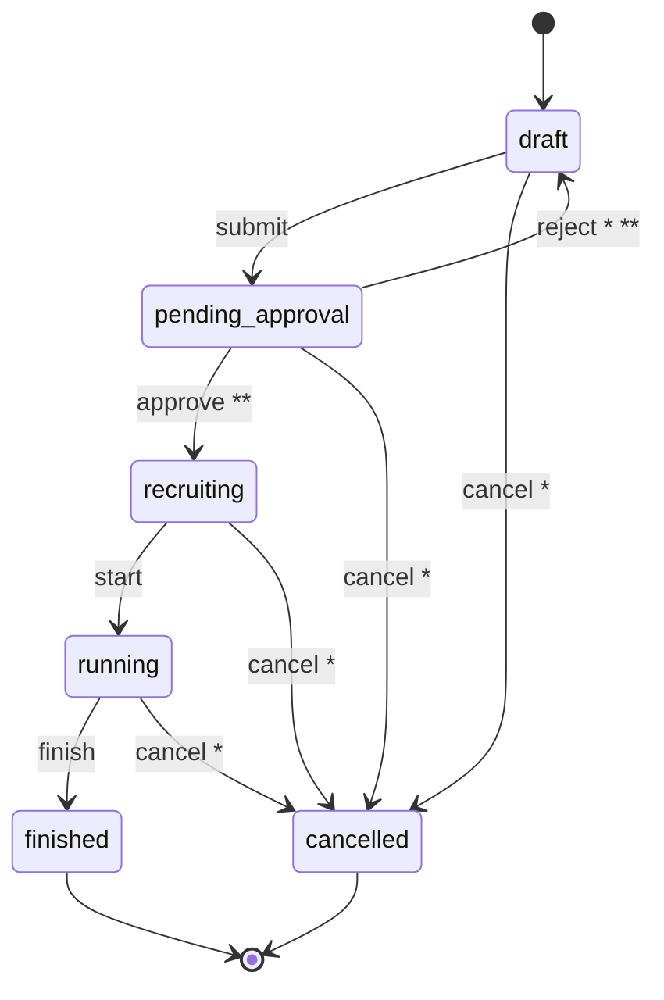

`*` bắt buộc lý do (`CLASS_REASON_EVENTS`, `lifecycle.ts:57`) · `**` cần quyền `class:approve` chứ không chỉ `class:update` (`CLASS_APPROVAL_EVENTS`, `lifecycle.ts:56`).

Điều kiện gửi duyệt/duyệt: `classReadiness` (`lifecycle.ts:68-78`) — phải có ngày khai giảng, kế hoạch lịch, giáo viên chính, sĩ số min/max hợp lệ, tổng buổi ≥ 1. Kết thúc lớp: `canFinishClass` chặn khi còn buổi chính thức chưa hoàn tất (`lifecycle.ts:81-83`). Huỷ lớp đang chạy là **huỷ dây chuyền** (rút ghi danh, huỷ buổi tương lai, sinh đề xuất hoàn tiền), chạy trong một transaction ở `packages/api/src/services/classOps.ts`.

**Đối chiếu bản gốc**: **khớp**. Gốc có `Đang lên KH, Tuyển sinh, Chờ duyệt (PENDING_APPROVAL), Đang dạy, Hoàn thành, Huỷ` (`KHAO-SAT-GOC-2.md:190`) — 6 trạng thái, ánh xạ đúng 6 trạng thái của bản mới.

### 3.4. Ghi danh — `packages/core/src/enrollment/lifecycle.ts:26-32`

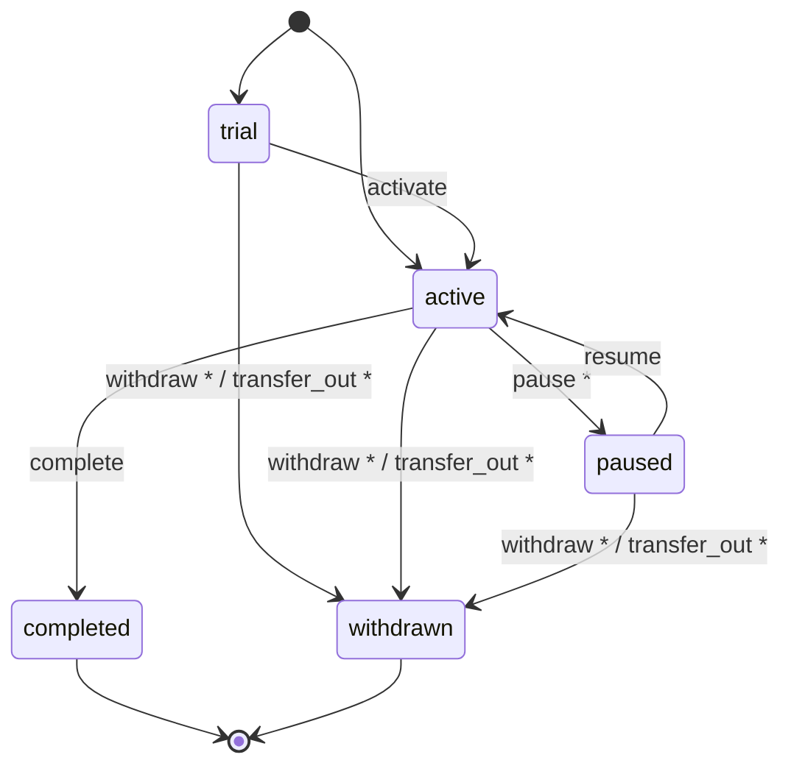

`*` = `EVENTS_REQUIRING_REASON` (`lifecycle.ts:36`). `transfer_out` không hiện trong menu thao tác (`ManualEnrollmentEvent`, `lifecycle.ts:52`) — chuyển lớp đi qua wizard riêng có duyệt.

Bảo lưu có luật riêng: tối đa 3 tháng (`DEFAULT_STUDENT_POLICY`, `lifecycle.ts:70`), `validatePause` chặn ngày trở lại quá hạn (`lifecycle.ts:83-94`), và `pauseReminder` (`lifecycle.ts:167-181`) sinh việc nhắc 3 loại: sắp tới ngày trở lại · quá ngày trở lại · quá hạn tối đa mà chưa hẹn ngày.

**Đối chiếu bản gốc**: **khác có chủ ý**. Gốc hiển thị 7 trạng thái (`Chờ xếp, Đã xếp, Đang học, Bảo lưu, Hoàn thành, Đã rút, Đã chuyển` — `KHAO-SAT-GOC-2.md:166`); bản mới lưu 5 và dựng lại "Chờ xếp / Đã xếp / Đã chuyển" từ `enrollment_events` + có/không `classId`. **Hệ quả cần biết**: bộ lọc "Chờ xếp lớp" ở màn Học viên của gốc hiện chưa có trong bản mới — xem `KT-13`.

### 3.5. Đơn hàng (suy từ tiền) — `packages/core/src/finance/rules.ts:509-563`

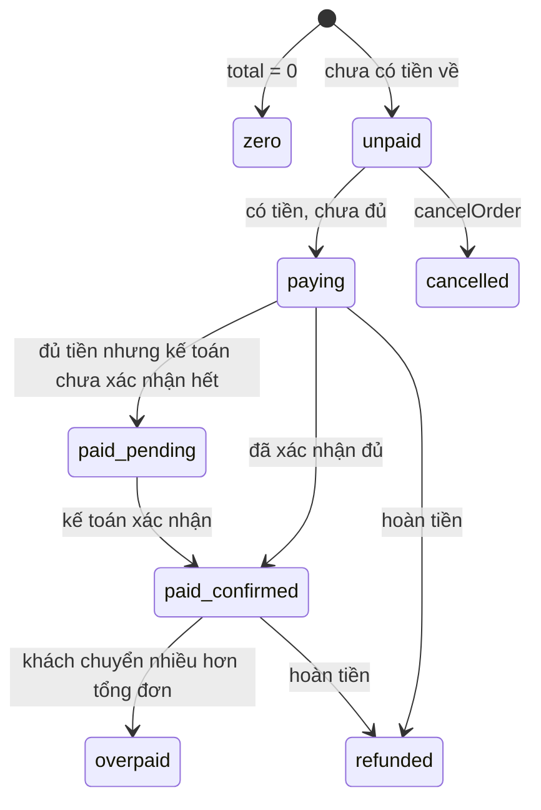

Điểm quan trọng: **trạng thái hiển thị suy từ tiền, không phải từ cột `orders.status`** (`ORDER_DISPLAY_TOOLTIP`, `rules.ts:521`). Cột `orders.status` chỉ còn giữ `cancelled` / `refunded`; còn lại `deriveOrderStatus` tính lại từ số đã xác nhận (`rules.ts:478-482`).

`canCancelOrder` (`rules.ts:484-489`): đơn đã có khoản **đã xác nhận** thì không huỷ — phải hoàn tiền; còn khoản **chờ xác nhận** thì kế toán xử lý trước.

**Đối chiếu bản gốc**: **khớp**. Sáu nhãn của gốc (`Chưa đóng · Đang đóng · Chờ kế toán đối soát · Kế toán đã đối soát · Đơn 0đ — chưa có học phí · Khách chuyển nhiều hơn tổng đơn`, `KHAO-SAT-GOC-2.md:309-310`) có đủ trong `ORDER_DISPLAY_VI` (`rules.ts:511-520`), chép đúng từng chữ.

### 3.6. Phiếu thu & hoàn tiền — `packages/core/src/finance/rules.ts:21-23, 818-829`

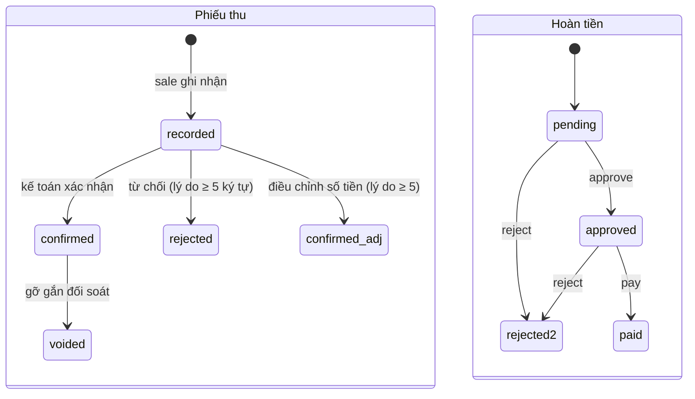

Luật bốn mắt: **người ghi nhận không tự xác nhận khoản của mình**, trừ SUPER_ADMIN (`validatePaymentDecision`, `rules.ts:635-647`).

Công thức hoàn tiền (`refundProposal`, `rules.ts:801-808`):
```
đơn giá buổi   = giá trị gói / số buổi của gói
đề xuất hoàn   = đã thu − (số buổi đã học × đơn giá buổi) − đã hoàn trước
                 (làm tròn XUỐNG nghìn, không âm)
```
Đúng công thức in trên trang của bản gốc: "Đề xuất = Σ đã thu − số buổi đã học × đơn giá" (`KHAO-SAT-GOC-2.md:351`). `validateRefundRequest` chặn hoàn vượt mức đề xuất và bắt lý do ≥ 5 ký tự (`rules.ts:810-816`).

**Đối chiếu bản gốc**: **khớp và làm hơn** — bản mới tự sinh đề xuất khi học viên nghỉ hẳn / chuyển lớp khác khoá / lớp bị huỷ (`packages/api/src/services/refundHooks.ts`).

### 3.7. Học bù — `packages/core/src/makeup/rules.ts:13-19`

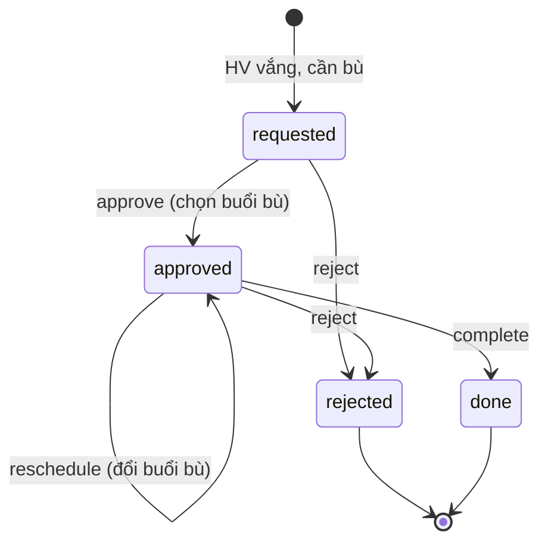

Buổi bù hợp lệ (`makeupCandidates`, `rules.ts:57-73`): **cùng khoá, cùng số thứ tự bài, lớp khác, chưa diễn ra (≥ hôm nay), chưa huỷ/dời/hoàn tất, còn chỗ**; ưu tiên cùng cơ sở rồi ngày gần nhất. Hạn xin bù mặc định 30 ngày kể từ buổi vắng (`withinMakeupWindow`, `rules.ts:44-47`).

Ai quyết định vào hàng đợi bù: **giáo viên chốt tại màn điểm danh** (`needsMakeupFor`, `rules.ts:81-85`) — dữ liệu cũ chưa có quyết định thì suy diễn "cứ vắng là chờ xếp bù".

**Đối chiếu bản gốc**: **khớp**. Gốc: `Chờ xếp bù → Đã xếp bù → Đã bù xong`, hiển thị "còn N chỗ" (`KHAO-SAT-GOC-2.md:224-226`). Bản mới thêm nhánh `rejected` và `reschedule`.

### 3.8. Ảnh lớp — `packages/core/src/media/consent.ts:8-19`

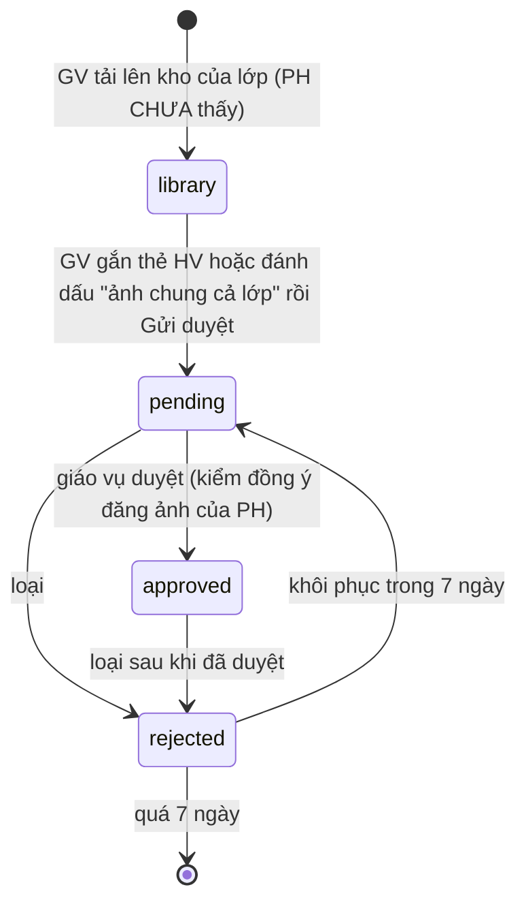

Ba luật cứng:
1. Gửi duyệt phải **nói rõ ảnh của ai**: gắn ít nhất một học viên hoặc đánh dấu ảnh chung cả lớp (`canSubmitMedia`, `consent.ts:97-106`).
2. Duyệt phải qua **kiểm đồng ý đăng ảnh (NĐ13)**: mọi học viên xuất hiện trong ảnh đều phải có ít nhất một phụ huynh đồng ý; thiếu một em là chặn cả ảnh (`consentCheck`, `consent.ts:29-32`).
3. Ảnh bị loại **khôi phục được trong 7 ngày** (`MEDIA_RESTORE_DAYS`, `consent.ts:78-89`).

Quá hạn duyệt: 24 giờ (`MEDIA_REVIEW_SLA_HOURS`, `consent.ts:69`). Buổi đã qua mà không có ảnh và chưa ghi nhận "không có ảnh" thì bị coi là quá hạn xử lý ảnh (`isSessionMediaMissing`, `consent.ts:108-113`).

**Đối chiếu bản gốc**: **khớp**, chép đúng cả hai tầng và mốc 7 ngày, 40 ảnh mỗi lô (`KHAO-SAT-GOC-2.md:212-221`).

### 3.9. Kỳ công — `packages/core/src/hr/rules.ts:729-770`

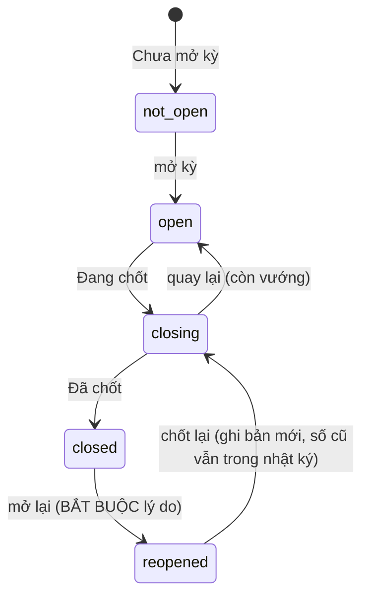

`periodFrozen(s) = closed | closing` (`rules.ts:752`) — đóng băng công. `periodEditable(s) = open | reopened` (`rules.ts:754`). Mọi đường ghi công (chấm công, duyệt đơn, xếp ca, ghi đè) gọi `assertOpen` trước và ném lỗi tiếng Việt rõ ràng nếu kỳ đã đóng băng (`packages/api/src/services/hrShared.ts:89-96`).

Điều kiện chốt (`lockCheck`, `rules.ts:787-796`): kỳ chưa kết thúc / còn đơn chờ duyệt / còn ngày có cờ chưa rà / còn ngày không có lượt quét — chia thành `blockers` (chặn) và `warnings` (cảnh báo).

**Ai chốt**: `timesheet:lock` — `HO_ACCOUNTANT` và `CENTER_ACCOUNTANT` (`packages/core/src/policy/policy.ts:92, 106`), đúng bản gốc "Kế toán cơ sở hoặc Kế toán Hội sở" (`KHAO-SAT-GOC-2.md:292`).

**Đối chiếu bản gốc**: **khớp** — đủ 5 trạng thái của gốc (`KHAO-SAT-GOC-2.md:286`), có cả giá trị cũ `locked` được chuẩn hoá về `closed` (`normalizePeriodStatus`, `rules.ts:745`).

### 3.10. Đơn từ nhân sự, hoàn thành khoá, trung tâm

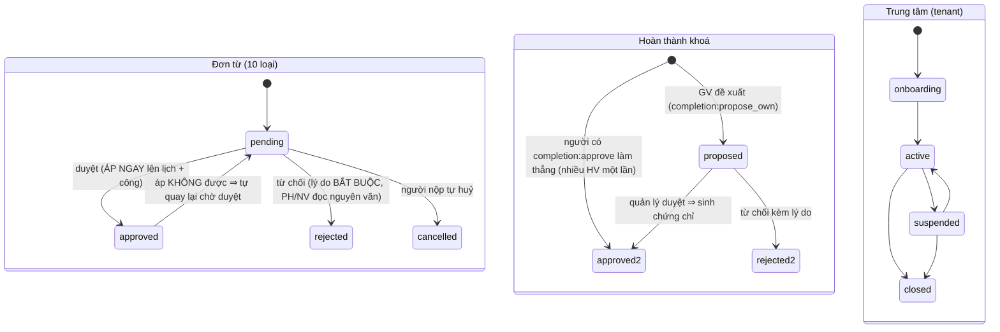

- **Đơn từ**: `requestTransition` (`packages/core/src/hr/rules.ts:679`) + hiệu ứng áp trong transaction con ở `packages/api/src/services/hrRequests.ts`. Luật gốc "áp không được thì đơn tự quay lại chờ duyệt" (`KHAO-SAT-GOC-2.md:299`) được cài đúng. **Đối chiếu: khớp** — đủ 10 loại (`REQUEST_KINDS`, `rules.ts:494-499`).
- **Hoàn thành khoá**: luồng đề xuất → duyệt như gốc (`KHAO-SAT-GOC-2.md:180`). **Đối chiếu: khớp**.
- **Trung tâm**: 4 trạng thái khai ở `packages/core/src/org/tenant.ts:40`. **Đối chiếu: THIẾU thực thi** — không có bảng chuyển hợp lệ, `updateSettings` ghi thẳng bất kỳ giá trị nào (`packages/api/src/services/tenants.ts:134, 141`); `suspended` và `onboarding` **không được kiểm ở bất cứ đâu** trong mã; `closed` chỉ ảnh hưởng tầm nhìn của Hội sở (`packages/core/src/org/tenant.ts:166`). Xem `KT-08`, `KT-09`.

---

## 4. Mô hình phân quyền

### 4.1. Sáu lớp, áp theo đúng thứ tự này

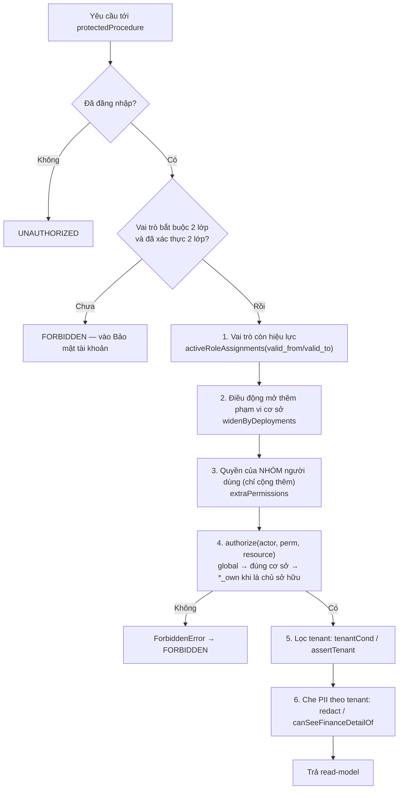

### 4.2. Vai trò × quyền

16 vai trò (`packages/core/src/policy/policy.ts:8-25`), bảng quyền tĩnh `ROLE_PERMISSIONS` (`policy.ts:90-112`). Quyền viết dạng `tài-nguyên:hành-động`, có ký tự đại diện:
- `*:*` — toàn quyền (chỉ `SUPER_ADMIN`).
- `finance:*` — mọi hành động trên tài chính.
- `*:read` — đọc mọi thứ (`AUDITOR`).
- `*_own` — chỉ dữ liệu mình phụ trách; `matches` quy định `*_own` khớp mọi hành động có hậu tố `_own` (`policy.ts:122`).

### 4.3. Phạm vi cơ sở

`RoleAssignment { role, centerId }`. `centerId = null` nghĩa là **toàn hệ thống** (vai trò Hội sở). Điều kiện phạm vi trong `authorize` (`policy.ts:144`):

```
scopeOk = a.centerId === null
       || resource.centerId === undefined
       || resource.centerId === null
       || a.centerId === resource.centerId
```

> **Trường hợp biên phải nhớ**: khi `resource.centerId` là `undefined` (người gọi không truyền) thì `scopeOk` **luôn đúng**. Nghĩa là quên truyền `centerId` = tắt kiểm phạm vi cơ sở. Đây là lý do mọi dịch vụ đều truyền `{ centerId }` tường minh, và các truy vấn danh sách dùng `scopeSql` / `scope` (`packages/api/src/services/hrShared.ts:48-53`, `packages/api/src/services/finance.ts:53-57`) để lọc trong SQL thay vì lọc sau.

### 4.4. Quyền sở hữu (`*_own`)

`isOwner = actor.personId && resource.ownerIds.includes(actor.personId)` (`policy.ts:140`). `personId` là `teachers.id` với giáo viên, `parents.id` với phụ huynh (`packages/api/src/context.ts:137`).

Hai nhánh trong vòng lặp (`policy.ts:146-155`):
- Xin quyền **không** `_own` (vd `session:update`): cần quyền đúng tên + đúng phạm vi. Giáo viên không có.
- Xin quyền **có** `_own` (vd `session:update_own`): cần quyền + đúng phạm vi + **là chủ sở hữu**.
- Xin quyền không `_own` nhưng actor chỉ có bản `_own`: được chấp nhận **nếu là chủ sở hữu** (`policy.ts:152-154`). Đây là lý do một service có thể viết `requirePermission(ctx, "session:update", { centerId, ownerIds })` một lần và phục vụ cả giáo vụ lẫn giáo viên chủ nhiệm.

### 4.5. Nhóm người dùng

`extraPermissions` chỉ **cộng thêm** (`policy.ts:158-167`). Nguồn dữ liệu: `user_group_members` ⋈ `user_group_permissions` ⋈ `user_groups` (`packages/api/src/context.ts:128-133`). Phạm vi cơ sở của một quyền nhóm: `g.centerId ?? g.groupCenterId ?? null` — quyền gắn cơ sở chỉ có hiệu lực ở cơ sở đó, nhóm toàn hệ thống thì theo dòng quyền (`context.ts:142`).

### 4.6. Điều động

`staff_deployments` mở thêm phạm vi cơ sở **trong đúng khoảng thời gian** (`context.ts:118-125`). Truy vấn đã lọc `effective_from <= today AND (effective_to IS NULL OR effective_to >= today)` ngay trong SQL, rồi `widenByDeployments` nhân bản các assignment sang cơ sở được điều động.

### 4.7. Trung tâm (tenant)

`tenantScope(actor, tenants)` — `packages/core/src/org/tenant.ts:157-171`:

| Tình huống | Kết quả |
|---|---|
| Không tra được tenant của actor | Khoá chặt về đúng tenant của actor |
| Actor thuộc tenant `FRANCHISE` | **Chỉ** tenant của mình — kể cả quản trị của tenant đó |
| Actor không có vai trò Hội sở (mọi assignment đều gắn cơ sở) | Chỉ tenant của mình |
| Actor Hội sở, **không** SUPER_ADMIN | Mọi tenant `OWNED` chưa đóng + tenant của mình |
| Actor Hội sở **và** SUPER_ADMIN | Mọi tenant chưa đóng (cả `FRANCHISE`) + tenant của mình |

Xem được **không có nghĩa là xem đầy đủ**: `canSeePii` và `canSeeFinanceDetail` (`tenant.ts:203-212`) chặn PII và chi tiết tài chính của tenant khác trừ khi tenant đó tự bật công tắc. `redact()` thay giá trị PII bằng dạng che (`tenantScope.ts:108-118`).

> ⚠ Lớp 5–6 **chưa phủ đều**: chỉ 18/74 dịch vụ gọi `tenantCond` / `assertTenant` / `redact`. Cụ thể `finance.debts` (`finance.ts:1322`), `finance.missingTuition` (`finance.ts:1374`), `finance.enrollmentDebts` (`finance.ts:1524`) và `commissions.listCommissions` (`commissions.ts:~55`) chỉ lọc theo **cơ sở**, không lọc tenant và không gọi `canSeeFinanceDetailOf`. Xem `KT-04`.

### 4.8. Các trường hợp biên khác phải nhớ

1. **Hết hạn vai trò là tự tắt** — `activeRoleAssignments(roles, today)` chạy mỗi lượt gọi với `today` theo giờ Việt Nam (`context.ts:111, 117`). Không có tác vụ nền nào phải đi gỡ quyền.
2. **Tài khoản bị khoá** — `!u.isActive` ⇒ `actor = null` ngay từ `createContext` (`context.ts:104`), mọi thủ tục thành `UNAUTHORIZED`.
3. **`hasPermission` khác `authorize`** — `hasPermission` (`policy.ts:208-213`) **bỏ qua phạm vi cơ sở và quyền sở hữu**, chỉ dùng để hiện/ẩn menu. Kiểm tra thật luôn là `authorize` ở service. Đừng bao giờ dùng `hasPermission` để quyết định cho ghi.
4. **`centersWith` trả `null`** nghĩa là toàn hệ thống, **không** phải "không có cơ sở nào" (`policy.ts:179-184`). Nhầm chỗ này là mở toang dữ liệu.
5. **Dữ liệu di sản chưa gắn tenant** (`tenant_id IS NULL`) **không bị chặn** (`tenantCond` có `isNull`, `tenantScope.ts:32`; `assertSameTenant` bỏ qua khi một vế null, `tenant.ts:186`). Đây là chủ ý để hệ một-tenant chạy y như trước, nhưng cũng nghĩa là trigger `fill_tenant_id` **phải** chạy được sau mỗi đợt nhập dữ liệu.

---

## 5. Mô hình tính tiền

Mọi số tiền là **số nguyên VND**. Không có số thực nào chạm vào cột tiền.

### 5.1. Định giá một dòng đơn — `packages/core/src/finance/rules.ts:282-310`

```
đơn giá sau hệ số  = round(giá gốc × COACH_MULTIPLIER[hình thức])
                     group 1 · coach_1_1 2 · coach_1_2 1,8 · coach_1_4 1,5   (rules.ts:146)
thành tiền (gross) = round(đơn giá sau hệ số × số lượng)
giảm của dòng      = Σ rawDiscountAmount(mỗi khoản giảm)      ← cộng dồn số CHƯA kẹp
nếu giảm > gross   → lỗi "Tổng giảm vượt thành tiền của dòng", kẹp về gross
net của dòng       = gross − giảm
tổng đơn           = Σ net các dòng                            (priceLines, rules.ts:313-325)
```

**Năm chính sách giảm giá** (`DISCOUNT_POLICIES`, `rules.ts:159-182`), chép đúng bản gốc (`KHAO-SAT-GOC-2.md:339`):

| Chính sách | Cách tính | Ràng buộc |
|---|---|---|
| `none` Không giảm | — | — |
| `percent` Giảm theo % | % trên giá niêm yết | 1..trần (mặc định 50%), **lý do ≥ 3 ký tự** |
| `amount` Giảm số tiền | số tiền VND | nguyên > 0, **lý do ≥ 3 ký tự** |
| `program` Ưu đãi chương trình | số tiền VND | như `amount` |
| `scholarship` Học bổng | % | như `percent` |

Trần % lấy từ cấu hình vận hành, mặc định `DEFAULT_MAX_LINE_DISCOUNT_PCT = 50` (`rules.ts:153`). Lý do giảm **luôn bắt buộc** trừ "không giảm" (`rules.ts:216`), và zod ở router cũng ép `reason` tối thiểu 3 ký tự (`packages/api/src/routers/finance.ts:21`).

**Gói cam kết giá cố định** (SR.QD.219 Điều 3/5) cấm bán dạng coach và cấm bán lẻ buổi (`rules.ts:291-294`).

### 5.2. Giá gói theo số buổi — `rules.ts:128-131`

```
giá gói = round( giá niêm yết khoá × số buổi gói / tổng buổi khoá / 1000 ) × 1000
```
Làm tròn nghìn để không bao giờ hiện số lẻ đồng trên phiếu thu.

### 5.3. Kế hoạch thanh toán — `rules.ts:372-399`

```
cọc (tuỳ chọn, luôn đứng đầu, hạn phải TRƯỚC hạn đợt 1)
phần còn lại = tổng − cọc
chia đều n phần (n ≤ 12 — MAX_INSTALLMENTS, rules.ts:335):
    base = floor(còn lại / n / 1000) × 1000
    n−1 đợt đầu = base, đợt cuối = còn lại − base × (n−1)   ← dồn dư vào đợt cuối
mốc hạn: theo tháng (addMonthsISO, kẹp cuối tháng) hoặc cách nhau 30 ngày
```

`validateInstallmentPlan` (`rules.ts:420-435`) kiểm: ≥ 1 đợt · ≤ 12 đợt (chưa kể cọc) · nhiều nhất một khoản cọc và cọc phải đứng đầu · mỗi đợt > 0 · có ngày hẹn · **tổng các đợt phải bằng tổng đơn** · hạn tăng dần.

`replanInstallments` (`rules.ts:447-459`) thêm hai luật khi sửa kế hoạch đang chạy: đợt **đã thu** không được xoá, và số tiền mới không được nhỏ hơn phần đã thu.

### 5.4. Công nợ và tuổi nợ — `rules.ts:468-503, 590-609`

```
đã xác nhận  = Σ payments.status = confirmed
chờ xác nhận = Σ payments.status = recorded
công nợ (PH đang thấy) = max(0, tổng − đã xác nhận)
thu vượt               = max(0, đã xác nhận − tổng)
```

`allocateInstallments` (`rules.ts:494-503`) phân bổ số đã xác nhận vào các đợt **theo thứ tự**, rồi tính số ngày quá hạn cho từng đợt còn nợ. Tuổi nợ chia theo hai mốc cấu hình được, mặc định `[7, 30]` ⇒ `Chưa quá hạn · 1–7 ngày · 8–30 ngày · > 30 ngày` (`agingBucketBy`, `rules.ts:595-600`) — đúng bản gốc (`KHAO-SAT-GOC-2.md:331`).

Sáu chip công nợ theo ghi danh (`enrollmentDebtChip`, `rules.ts:581-588`) khớp đủ sáu nhãn gốc (`KHAO-SAT-GOC-2.md:329`).

### 5.5. Hoa hồng — `packages/core/src/finance/commission.ts`

Máy chính sách khai theo **4 trục** như bản gốc (`KHAO-SAT-GOC-2.md:365-371`):

1. **Chi khi nào** — `COMMISSION_EVENTS`: `HOC_VIEN_MOI`, `TAI_TUC`, `CHUYEN_TRUNG_TAM`, `BAN_THIET_BI`, `MOI_NHAN_SU`, `THUONG_DANH_HIEU_TVV`, `THUONG_DANH_HIEU_QUAN_LY` (`commission.ts:116-126`).
2. **Cho loại đơn nào** — `COMMISSION_SCOPES`.
3. **Tính thế nào** — `COMMISSION_CALC_METHODS`: `percent` (điểm cơ bản, 500 = 5%) · `fixed` (VND mỗi đơn vị) · `tier` (bảng bậc doanh thu).
4. **Ai nhận bao nhiêu** — `commission_policy_shares` theo vai, mỗi vai một mức + trần riêng.

**Trần tổng 9%** (`DEFAULT_COMMISSION_TOTAL_CAP_PCT`, `commission.ts:192`): kiểm cộng dồn mọi chính sách đang hiệu lực **cùng sự kiện + cùng loại đơn + cùng phạm vi cơ sở** (`commission.ts:244-289`); ở phương pháp bậc thì lấy **bậc % cao nhất** để trần đúng cả ở trường hợp xấu nhất (`commission.ts:197-198`). Sửa chính sách **bắt buộc ghi lý do** (`packages/api/src/routers/finance.ts:239`).

Dòng hoa hồng đã sinh **không đổi theo chính sách mới** — `accrueMissing` chỉ tạo dòng còn thiếu, có `onConflictDoNothing` (`commissions.ts:~50`).

### 5.6. Sổ cái và đối soát

- `finance_ledger` chỉ-thêm (trigger, `0001_constraints.sql:50-57`). Loại bút toán: `charge · payment · refund · cancel · adjustment` (`rules.ts:84`).
- Đối khớp chuyển khoản: `extractOrderRef` đọc mã đơn trong nội dung, nhận **cả hai dạng** `ORD-YYMMDD-NNNNNN` (bản gốc) và `DHyy-NNNNNN` (bản mới) (`rules.ts:697-703`). Nội dung chuyển khoản sinh ra bằng `transferMemo` — bỏ hết ký tự đặc biệt để ngân hàng không cắt (`rules.ts:689-691`).
- Rót tiền vào từng dòng đơn: `bank_tx_allocations`; phần dư **không tự hoàn, không trừ sang đơn khác** mà tạo một đợt mới trên chính đơn đó rồi rót vào (`packages/api/src/routers/finance.ts:176-180`) — đúng bản gốc (`KHAO-SAT-GOC-2.md:346`).

---

## 6. Tám luồng nghiệp vụ đầu-cuối

### 6.1. Từ lead tới ghi danh và thu tiền

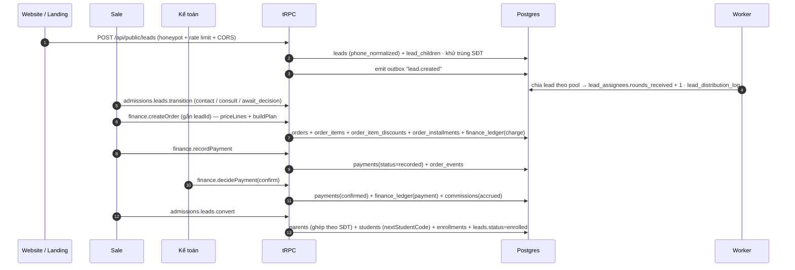

| Bước | Ai làm | Procedure | Bảng bị ghi | Nhật ký |
|---|---|---|---|---|
| Nhận lead từ web | Hệ thống | `POST /api/public/leads` (`apps/web/src/app/api/public/leads/route.ts:32`) | `leads`, `lead_children`, `webhook_events`, `track_events` | `webhook_events` |
| Chia lead | Worker / `lead:update` | `distributePool` (`admissionsAdmin.ts:294`) | `leads.assigned_to_id`, `lead_assignees`, `lead_distribution_log` | `audit_log` + sổ chia chỉ-thêm |
| Đổi trạng thái | Sale (`lead:update_own`) | `admissions.leads.transition` | `leads`, `lead_activities` | `audit_log` (TRANSITION) |
| Tạo đơn | Sale (`finance:create`) | `finance.createOrder` (`finance.ts:427`) | `orders`, `order_items`, `order_item_discounts`, `order_installments`, `order_private`, `finance_ledger` | `audit_log` + `order_events` |
| Ghi nhận thu | Sale (`finance:create`) | `finance.recordPayment` (`finance.ts:995`) | `payments` | `audit_log` + `order_events` |
| Xác nhận thu | Kế toán (`finance:confirm`) | `finance.decidePayment` (`finance.ts:1124`) | `payments`, `finance_ledger`, `commissions` | `audit_log` |
| Chốt lead | Sale (`enrollment:create`) | `admissions.leads.convert` (`leads.ts:853-960`) | `parents`, `students`, `student_guardians`, `enrollments`, `leads` | `audit_log` |

**Cửa chặn**: chốt lead khi chưa ghi nhận thanh toán bị chặn (`docs/CHECKLIST-DOI-SANH.md:44`); mã học viên sinh bằng `max(code)` của cơ sở + năm, gọi **trong transaction** (`students.ts:357-364`) nên không trùng.

### 6.2. Một buổi học từ lúc sinh ra tới lúc chốt

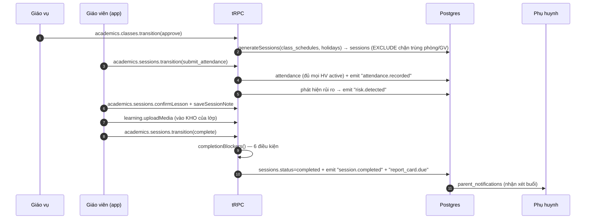

| Bước | Ai làm | Procedure | Bảng bị ghi | Nhật ký |
|---|---|---|---|---|
| Sinh buổi | `class:approve` | `classOps.transitionClass` | `sessions`, `class_events` | `audit_log` |
| Điểm danh | GV (`attendance:write_own`) | `academics.sessions.transition` (`sessions.ts:177-230`) | `attendance`, `sessions.status`, `outbox` | `audit_log` (`sessions.ts:155`) |
| Xác nhận bài đã dạy | GV | `academics.sessions.confirmLesson` | `sessions.lesson_confirmed_at/by` | `audit_log` |
| Nhận xét | GV | `academics.sessions.saveNote` | `sessions.session_note`, `attendance.remark` | `audit_log` |
| Ảnh vào kho | GV (`media:write_own`) | `learning.uploadMedia` (`media.ts:57`) | `session_media` (`library`) + object storage | `audit_log` |
| Hoàn tất | GV | `academics.sessions.transition(complete)` (`sessions.ts:279-287`) | `sessions`, `outbox` | `audit_log` (TRANSITION) |

### 6.3. Xin học bù

```mermaid
sequenceDiagram
    autonumber
    participant PH as Phụ huynh / CSKH
    participant GVU as Giáo vụ
    participant API as tRPC
    participant DB as Postgres

    Note over PH: HV vắng buổi N — GV đã đánh dấu "Cần học bù" khi điểm danh
    PH->>API: learning.requestMakeup(enrollmentId, missedSessionId)
    API->>API: withinMakeupWindow(missedDate, today) ≤ 30 ngày
    API->>DB: makeup_requests(status=requested)
    GVU->>API: learning.makeupCandidates(requestId)
    API->>API: makeupCandidates() — cùng khoá + cùng số bài + lớp khác + còn chỗ + chưa diễn ra
    GVU->>API: learning.decideMakeup(approve, targetSessionId)
    API->>DB: makeup_requests(status=approved, target_session_id)
    Note over GVU: Tới ngày bù — điểm danh buổi đích
    API->>DB: makeup_requests(status=done)
```

| Bước | Ai làm | Procedure | Bảng bị ghi | Nhật ký |
|---|---|---|---|---|
| Đánh dấu cần bù | GV | `academics.sessions.transition(submit_attendance)` | `attendance.needs_makeup` | `audit_log` |
| Tạo yêu cầu | PH (`makeup:request_own`) / CSKH (`makeup:create`) | `learning.requestMakeup` (`makeup.ts`) | `makeup_requests` | `audit_log` |
| Chọn buổi bù | Giáo vụ (`makeup:update`) | `learning.decideMakeup` | `makeup_requests` | `audit_log` (TRANSITION) |
| Ghi nhận đã bù | Giáo vụ | `learning.completeMakeup` | `makeup_requests`, `attendance` buổi đích | `audit_log` |

### 6.4. Chốt kỳ công và trả lương

```mermaid
sequenceDiagram
    autonumber
    participant QL as Quản lý cơ sở
    participant KT as Kế toán
    participant API as tRPC
    participant DB as Postgres

    Note over QL: Trong tháng — lưới phân ca đã sinh, nhân sự quét QR ở quầy
    QL->>API: hr.timesheet(centerId, period)
    API->>API: buildDays() → computeDay() cho từng người/ngày (theo Ô PHÂN CA, không theo lượt quét)
    API-->>QL: bảng công + openFlags (15 cờ cần rà)
    QL->>API: hr.reviewFlag(staffId, date, flag, action) — ack / dismiss / excused / unexcused
    API->>DB: timesheet_flag_reviews
    QL->>API: hr.overrideDay(staffId, date, units, reason)
    API->>DB: timesheet_overrides (0 ≤ units ≤ 1,5 — ràng buộc CSDL)
    KT->>API: hr.setPeriodStatus(closed)
    API->>API: lockCheck() — kỳ chưa kết thúc / đơn chờ duyệt / cờ chưa rà / ngày không lượt
    API->>DB: timesheet_periods(status=closed) → assertOpen chặn MỌI đường ghi công
    Note over KT: Mở lại kỳ BẮT BUỘC lý do; số đã chốt vẫn nằm trong audit_log
```

| Bước | Ai làm | Procedure | Bảng bị ghi | Nhật ký |
|---|---|---|---|---|
| Sinh lưới phân ca | `timesheet:update` | `hr.generateRoster` (chạy thử → ghi thật) | `shift_assignments` (kèm ảnh chụp giờ/công) | `audit_log` |
| Nhập lưới từ Sheet | `timesheet:update` | `hr.importRoster` (`hr.ts:660-703`) | `shift_assignments` (`origin=import`), `roster_imports` | `audit_log` |
| Quét QR | Nhân sự | `hr.punch` (`hrCheckin.ts:144-183`) | `attendance_punches` (chỉ-thêm) | bản ghi chính là nhật ký |
| Rà cờ | Quản lý (`timesheet:approve`) | `hr.reviewFlag` | `timesheet_flag_reviews` | `audit_log` |
| Ghi đè công | Quản lý | `hr.overrideDay` | `timesheet_overrides` | `audit_log` |
| Chốt kỳ | Kế toán (`timesheet:lock`) | `hr.setPeriodStatus` (`hr.ts:901`) | `timesheet_periods` | `audit_log` |

**Geofence**: từ khi bật `geofence_enabled` và đã khai toạ độ, quét ngoài bán kính bị **TỪ CHỐI** chứ không chỉ gắn cờ (`hrCheckin.ts:152-153`), đúng thay đổi 07/09 của bản gốc (`KHAO-SAT-GOC-2.md:282-283`). Người bị chặn nhầm nộp đơn chỉnh công.

### 6.5. Duyệt ảnh lớp

```mermaid
sequenceDiagram
    autonumber
    participant GV as Giáo viên
    participant GVU as Giáo vụ
    participant API as tRPC
    participant DB as Postgres
    participant PH as Phụ huynh

    GV->>API: learning.uploadMedia (≤ 40 ảnh/lô, ≤ 10MB, jpeg/png/webp)
    API->>DB: session_media(status=library) + object storage (khoá đã kiểm an toàn)
    GV->>API: learning.tagMedia(studentIds | isClassWide)
    GV->>API: learning.submitMedia(ids)
    API->>API: canSubmitMedia() — phải nói rõ ảnh của ai
    API->>DB: session_media(status=pending, submitted_at) ← mốc SLA 24 giờ
    GVU->>API: learning.reviewMedia(ids, approve)
    API->>API: mediaAudience() → consentCheck() — MỌI em trong ảnh phải có PH đồng ý
    API->>DB: session_media(approved) + parent_notifications cho từng PH
    DB->>PH: thông báo "Ảnh buổi N · lớp X"
    Note over GVU: Loại ảnh ⇒ rejected, còn khôi phục 7 ngày
```

| Bước | Ai làm | Procedure | Bảng bị ghi | Nhật ký |
|---|---|---|---|---|
| Tải vào kho | GV (`media:write_own`) | `learning.uploadMedia` (`media.ts:57`) | `session_media`, object storage | `audit_log` |
| Gắn thẻ | GV | `learning.tagMedia` | `session_media.tagged_student_ids` | `audit_log` |
| Gửi duyệt | GV | `learning.submitMedia` (`media.ts:200`) | `session_media` | `audit_log` (TRANSITION) |
| Duyệt / loại | Giáo vụ (`media:update`) | `learning.reviewMedia` (`media.ts:260`) | `session_media`, `parent_notifications` | `audit_log` |
| Khôi phục | Giáo vụ | `learning.restoreMedia` (`media.ts:220`) | `session_media` | `audit_log` |
| "Buổi này không có ảnh" | Giáo vụ | `learning.markNoMedia` | `sessions.no_media_at/by` | `audit_log` |

### 6.6. Cấp chứng chỉ hoàn thành khoá

```mermaid
sequenceDiagram
    autonumber
    participant GV as Giáo viên
    participant QL as Quản lý / Đào tạo
    participant API as tRPC
    participant DB as Postgres

    GV->>API: learning.proposeCompletion(enrollmentId, grade, teacherReview)
    Note right of GV: Xếp loại cuối khoá + Đánh giá cuối khoá của GV — BẮT BUỘC
    API->>DB: course_completions(status=proposed)
    QL->>API: learning.decideCompletion(approve)
    API->>DB: course_completions(status=approved, certificate_no, issued_at)
    API->>DB: enrollments.status = completed (enrollmentTransition "complete")
    QL->>API: (tuỳ chọn) hoàn thành NHIỀU học viên một lần
    Note over QL: In chứng chỉ ở /hoan-thanh-khoa/chung-chi/[id] → window.print()
```

| Bước | Ai làm | Procedure | Bảng bị ghi | Nhật ký |
|---|---|---|---|---|
| Đề xuất | GV (`completion:propose_own`) | `learning.proposeCompletion` | `course_completions` | `audit_log` |
| Duyệt / từ chối | `completion:approve` | `learning.decideCompletion` | `course_completions`, `enrollments` | `audit_log` (TRANSITION) |
| In chứng chỉ | Ai xem được | trang `/hoan-thanh-khoa/chung-chi/[id]` (`apps/web/src/app/(admin)/hoan-thanh-khoa/chung-chi/[id]/print.tsx:4`) | — | — |

### 6.7. Mở một trung tâm nhượng quyền

```mermaid
sequenceDiagram
    autonumber
    participant SA as SUPER_ADMIN chuỗi
    participant API as tRPC
    participant DB as Postgres
    participant QT as Quản trị trung tâm mới

    SA->>API: tenants.previewProvision(sourceTenantId)
    API-->>SA: bảng kê "sẽ tạo những gì, bao nhiêu bản ghi"
    SA->>API: tenants.provision({ code, name, pháp nhân, hợp đồng, cơ sở đầu tiên, adminEmail, reason ≥ 10 ký tự })
    API->>DB: MỘT transaction
    Note right of DB: tenants + tenant_settings (FRANCHISE ⇒ đóng hết mặc định)<br/>centers + rooms<br/>nhân bản courses · curricula · commission_policies · user_groups<br/>users (quản trị, isActive=false, chờ thư mời)
    API->>DB: audit_log (tenantId = tenant MỚI)
    QT->>API: đặt mật khẩu qua liên kết dùng một lần
    QT->>API: tenants.updateSettings (bật/tắt hoSeesPii, hoSeesFinanceDetail…)
    Note over QT: CHỈ quản trị của chính trung tâm đó bật được — Hội sở chuỗi KHÔNG tự mở
```

| Bước | Ai làm | Procedure | Bảng bị ghi | Nhật ký |
|---|---|---|---|---|
| Xem trước | `tenant:provision` | `tenants.previewProvision` (`provisionTenant.ts`) | — | — |
| Nhân bản | `tenant:provision` | `tenants.provision` (`routers/tenants.ts:41-62`) | `tenants`, `tenant_settings`, `centers`, `rooms`, `courses`, `curricula`, `commission_policies`, `user_groups`, `users` | `audit_log` (tenantId mới) |
| Mở/đóng chia sẻ dữ liệu | Quản trị **của chính tenant** | `tenants.updateSettings` (`tenants.ts:104-147`) | `tenant_settings`, `tenants.status` | `audit_log`, lý do ≥ 5 ký tự |

### 6.8. Đóng một trung tâm

```mermaid
sequenceDiagram
    autonumber
    participant SA as Quản trị
    participant API as tRPC
    participant DB as Postgres

    SA->>API: tenants.updateSettings({ tenantId, status: "closed", reason })
    API->>API: requirePermission("tenant:update") + assertTenant + canEditSettings
    API->>DB: tenants.status = "closed"
    API->>DB: audit_log
    Note over DB: HẾT. Không có gì khác xảy ra.
    rect rgb(255, 235, 235)
        Note over API,DB: CHƯA CÓ: kiểm còn lớp đang chạy / công nợ chưa thu / kỳ công chưa chốt<br/>CHƯA CÓ: khoá tài khoản nhân sự của tenant đó<br/>CHƯA CÓ: xuất dữ liệu bàn giao · đặt hạn lưu trữ · chuyển sang chỉ-đọc<br/>CHƯA CÓ: máy trạng thái — closed quay ngược về active được
    end
```

| Bước | Ai làm | Procedure | Bảng bị ghi | Nhật ký |
|---|---|---|---|---|
| Đổi trạng thái | `tenant:update` của chính tenant | `tenants.updateSettings` (`tenants.ts:141`) | `tenants.status` | `audit_log` |
| Hệ quả duy nhất | — | `tenantScope` loại tenant `closed` khỏi tầm nhìn Hội sở (`packages/core/src/org/tenant.ts:166`) | — | — |

**Đối chiếu bản gốc**: bản gốc cũng chỉ có `status` của đơn vị tổ chức ("Chỉ đơn vị **Đang hoạt động** được tính khi xét quyền" — `KHAO-SAT-GOC-2.md:398`), nhưng **bản gốc có thực thi luật đó**, còn bản mới thì `suspended` / `onboarding` không được kiểm ở đâu cả. Đây là khoảng trống `KT-08` / `KT-09` — luồng 6.8 hiện là luồng yếu nhất trong tám luồng.

---

## 7. Những quyết định kiến trúc đáng chú ý và đánh đổi

### QĐ-1. Monolith có mô-đun, không microservices
**Quyết định**: một tiến trình, bốn gói, ranh giới bằng quy ước thư mục (`docs/ARCHITECTURE.md:27`).
**Được**: một transaction bao trọn nghiệp vụ + nhật ký + sự kiện ⇒ không bao giờ có trạng thái nửa vời. Triển khai một lần. Đội 1–3 người theo nổi.
**Mất**: không co giãn từng phần; một truy vấn nặng (vd `missingTuition`, `finance.ts:1374`) kéo chậm cả hệ. Ranh giới gói chỉ là quy ước — không có gì chặn ai đó gọi Drizzle từ `packages/core`.
**Đúng với quy mô 2–10 cơ sở.** Nếu chuỗi vượt ~50 cơ sở thì phải tách đọc/ghi trước khi nghĩ tới tách dịch vụ.

### QĐ-2. Quy tắc nghiệp vụ thuần, tách hẳn khỏi CSDL
**Quyết định**: máy trạng thái và công thức tiền nằm trong `packages/core`, không biết Drizzle.
**Được**: 55 tệp kiểm thử chạy trong vài giây, không cần Postgres. Một chỗ sửa áp cho web + app giáo viên + cổng phụ huynh. Thay đổi luật đọc được ngay từ mã, không phải dò qua nhiều tầng.
**Mất**: phải nạp đủ dữ liệu vào bộ nhớ trước khi gọi core, nên vài chỗ nạp thừa (vd `buildDays` nạp toàn bộ ngày lễ trong khoảng rồi lọc theo cơ sở trong JS — `hrShared.ts:164`). Một số luật muốn thành `CHECK` ở CSDL thì phải viết hai lần (một ở core, một ở SQL).

### QĐ-3. Phân quyền ở tầng dịch vụ, RLS chỉ là lớp cuối
**Quyết định**: ADR-004 (`docs/ARCHITECTURE.md:30`). Một bộ luật duy nhất, mọi thủ tục đi qua.
**Được**: giải thích được **vì sao** ai đó làm được gì (`Decision.reason`, `policy.ts:126-130`), test được bằng ma trận, dựng được màn "Vai trò & quyền" đọc thẳng từ bộ luật.
**Mất**: **quên truyền `centerId` là tắt kiểm phạm vi** (`policy.ts:144`). Không có lưới an toàn ở CSDL. Bù lại bằng kỷ luật viết mã + kiểm thử ma trận quyền trong CI (`.github/workflows/ci.yml`).

### QĐ-4. Bảng vai trò tĩnh trong mã, không phải trong CSDL
**Quyết định**: `ROLE_PERMISSIONS` là hằng số TypeScript (`policy.ts:90-112`); trang `/roles` chỉ đọc ("nguồn sự thật ở máy chủ, không sửa tay" — `apps/web/src/app/(admin)/roles/page.tsx:25`).
**Được**: không ai tự cấp quyền cho mình qua giao diện; thay đổi quyền đi qua review + CI; kiểu TypeScript kiểm được ở compile-time.
**Mất**: **bản gốc có RBAC động** (`roles: manage assign`, `KHAO-SAT-GOC-2.md:56, 405`) — không tạo được vai trò riêng cho một cơ sở mà phải đổi mã và triển khai lại. Lối thoát hiện có là **nhóm người dùng** (cộng thêm quyền), nhưng nhóm không bớt được quyền. Xem `KT-10`.

### QĐ-5. Tenant là cột trên bảng, không phải schema riêng / CSDL riêng
**Quyết định**: `tenant_id` trên 42 bảng + `tenantCond` trong `WHERE` (`tenantScope.ts:24-33`); dòng chưa gắn tenant vẫn hiện.
**Được**: một CSDL, một bộ migration, báo cáo toàn chuỗi là một câu truy vấn. Hệ một-tenant chạy y như trước khi có tính năng nhượng quyền.
**Mất**: **cách ly chỉ mạnh bằng chỗ yếu nhất** — quên `tenantCond` ở một truy vấn là rò dữ liệu, và hiện chỉ 18/74 dịch vụ gọi nó (`KT-04`). `tenant_id IS NULL` được cho qua nên trigger `fill_tenant_id` là bộ phận sống còn. Với bên nhận nhượng quyền yêu cầu cách ly hợp đồng cứng thì mô hình này chưa đủ.

### QĐ-6. Lịch học là dữ liệu; buổi học là máy trạng thái
**Quyết định**: ADR-002, ADR-003 (`docs/ARCHITECTURE.md:28-29`). Ba dải số buổi (chính thức / ngoài lộ trình / đã huỷ).
**Được**: mọi hàng đợi "chưa hoàn tất" là một câu `WHERE status IN (…)`; huỷ có dời bù giữ nguyên tổng buổi; đổi lịch giữa khoá là thêm giai đoạn.
**Mất**: dải số là quy ước ngầm (`> 5000` = đã huỷ) không được CSDL bảo vệ; ai `INSERT` thẳng sai dải là hỏng nhãn hiển thị. Và **đường huỷ buổi qua đơn từ đang đi tắt, không theo luật này** (`hrSessionEffects.ts:34` — khoảng trống `KT-01`).

### QĐ-7. Chấm công theo lịch đã xếp, lượt quét chỉ sinh cờ
**Quyết định**: chép đúng nguyên tắc gốc (`KHAO-SAT-GOC-2.md:252`); ô phân ca lưu **ảnh chụp** giờ và số công.
**Được**: sửa danh mục mã ca không viết lại lịch sử công; mất mạng / quên quét không tự trừ lương; tranh chấp lương giải được bằng một bảng cờ + kết luận của quản lý.
**Mất**: bảng công **không tự đúng** — phải có người rà cờ. Nếu không ai rà thì kỳ công vẫn chốt được (chỉ là cảnh báo, không chặn — `lockCheck`, `rules.ts:787-796`). Dữ liệu phình: mỗi ô phân ca mang thêm ba cột ảnh chụp.

### QĐ-8. Tiền là số nguyên VND, sổ cái chỉ-thêm
**Quyết định**: mọi công thức `Math.round` về số nguyên trước khi chạm cột tiền; `finance_ledger` chặn `UPDATE`/`DELETE` bằng trigger.
**Được**: không có sai số dấu phẩy động; dựng lại được số liệu kế toán ở bất kỳ mốc nào; điều chỉnh là bút toán mới nên luôn giải thích được.
**Mất**: sửa một sai sót nhỏ cũng phải lập bút toán ⇒ sổ dài hơn, báo cáo phải luôn cộng dồn. Chia đều dồn dư vào đợt cuối (`splitEven`, `rules.ts:352-356`) làm đợt cuối lệch tới vài nghìn — chấp nhận được vì tổng luôn khớp.

### QĐ-9. Outbox cho sự kiện miền, viết trong cùng transaction
**Quyết định**: `emit(tx, event)` (`outbox.ts:5-8`) + worker/cron xử lý sau.
**Được**: nghiệp vụ không chờ gửi tin; nghiệp vụ rollback thì sự kiện cũng rollback (không có thông báo ma); thêm luật tự động chỉ là thêm rule trong core.
**Mất**: chưa có khoá chiếm việc, chưa có giãn cách thử lại, chưa có đường chạy lại thư chết (`KT-03`). Thứ tự sự kiện chỉ đảm bảo theo `createdAt` chứ không theo thực thể.

### QĐ-10. Giữ nguyên đường dẫn của bản gốc
**Quyết định**: 118 mục menu chép đúng thứ tự, nhãn và `href` của `admin.satarobo.vn` (`apps/web/src/lib/admin-nav.ts:1-2`).
**Được**: nhân sự không phải học lại; dấu trang cũ còn dùng được; đối sánh từng màn với bản gốc dễ.
**Mất**: mang theo cả những chỗ đặt tên không hay của bản gốc (`/lead-nguoi` cho "lead lâu ngày chưa chăm", `/bt` cho bài tập); và trường `ready` + trang bắt-tất-cả `[...slug]` sinh ra cho giai đoạn xây dở **nay đã chết** vì mọi mục đều `ready: true` (`KT-21`).

---

## Phụ lục — bản đồ tệp để tra nhanh

| Muốn biết | Đọc tệp |
|---|---|
| Ai được làm gì | `packages/core/src/policy/policy.ts` |
| Dựng ngữ cảnh đăng nhập, gom vai trò | `packages/api/src/context.ts` |
| Chặn chưa đăng nhập / chưa 2FA, ánh xạ lỗi miền | `packages/api/src/trpc.ts` |
| Cách ly trung tâm | `packages/core/src/org/tenant.ts` + `packages/api/src/services/tenantScope.ts` |
| Công thức tiền | `packages/core/src/finance/rules.ts` |
| Chính sách hoa hồng | `packages/core/src/finance/commission.ts` |
| Vòng đời lead | `packages/core/src/admissions/leadMachine.ts` |
| Vòng đời buổi học | `packages/core/src/sessions/stateMachine.ts` |
| Vòng đời lớp, dải số buổi | `packages/core/src/classes/lifecycle.ts` |
| Vòng đời ghi danh, chuyển lớp | `packages/core/src/enrollment/lifecycle.ts` |
| Chấm công, đơn từ, kỳ công | `packages/core/src/hr/rules.ts` + `shifts.ts` |
| Ảnh lớp, đồng ý NĐ13 | `packages/core/src/media/consent.ts` |
| Ràng buộc CSDL, trigger chỉ-thêm | `packages/db/sql/0001_constraints.sql` |
| Cách ly tenant ở CSDL | `packages/db/sql/0005_nhuong_quyen.sql` |
| Việc nền | `packages/api/src/worker.ts` + `apps/web/src/app/api/cron/outbox/route.ts` |
| Menu và đường dẫn | `apps/web/src/lib/admin-nav.ts` |
